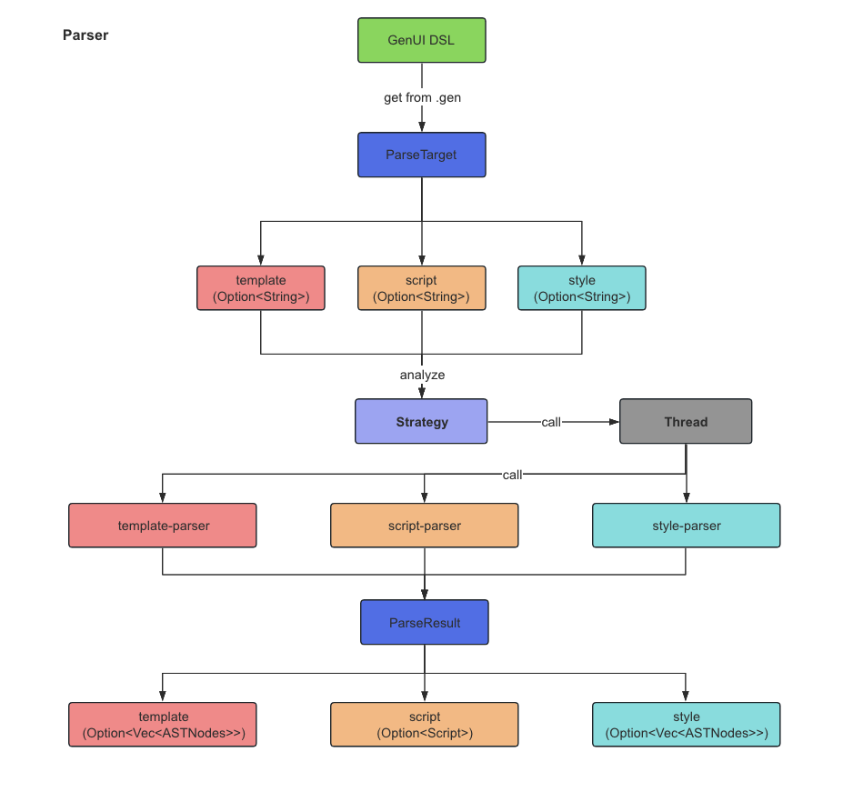

# Parser

## Parse GenUI DSL to AST

```shell
                                                   Real AST
-------------       ---------------   Strategy   ---------------
| GenUI DSL |  -->  | ParseTarget |  ----------> | ParseResult |
-------------       ---------------              ---------------  
```



## Example

```rust
fn test1() {
    let input = r#"
        <style>
        .app{
            height: Fill;
            width: Size::Fit;
            max_height: Size::Fixed(100.0);
            font_size: 12.2;
            user: {
                name: "user1",
                age: 20,
            };
            padding: Layout::Padding{
                top: 10,
                left: 20,
                right: 20,
                bottom: 10,
            };
            .box {
                color: linear_gradient(#000, #fff, #333);
                img: dep("crate://self/img.png");
                text_align: TextAlign::Center;
                background_color: #f00;
                margin: 10 30;
                text: $DEFAULT_TEXT;
                list: [1, 2, 3];
            }
        }
        </style>
    "#;

let res = ParseResult::try_from(ParseTarget::try_from(input).unwrap()).unwrap();
dbg!(res);
```
