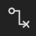

# Icon Lib v0.1.0

当前GenUI的内置图标库共有75个图标，分为以下几种类别:
1. Base
2. Arrow
3. Code
4. Emoji
5. Fs
6. Person
7. Relation
8. State
9. Time
10. Tool
11. UI

> **当前该图标库只是一个实验功能**
> ### 优点
> 1. 无版权, 完全商用免费
> 2. 体积小
> 3. 无需联网下载进行引入
> 4. 直接使用Shader进行绘制
> ### 后续更新方案
> 1. 去除None类型改用属性标记方式
> 2. 增加图标到约150个常用图标
> 3. 优化图标体验

## Base

<table cellspacing="0">
  <tbody>
    <tr>
      <td style="width: 100px">
        

          
        

        
Min

      </td>
      <td style="width: 100px">
        

          
        

        
Max

      </td>
      <td style="width: 100px">
        

          
        

        
FullScreen

      </td>
      <td style="width: 100px">
        

          
        

        
FullScreenExpand

      </td>
      <td style="width: 100px">
        

          
        

        
More

      </td>
      <td style="width: 100px">
        

          
        

        
Upload

      </td>
      <td style="width: 100px">
        

          
        

        
Download

      </td>
      <td style="width: 100px">
        

          
        

        
Add

      </td>
    </tr>
    <tr>
      <td style="width: 100px">
        

          
        

        
Delete

      </td>
      <td style="width: 100px">
        

          
        

        
DeleteKey

      </td>
      <td style="width: 100px">
        

          
        

        
Correct

      </td>
      <td style="width: 100px">
        

          
        

        
Fresh

      </td>
      <td style="width: 100px">
        

          
        

        
Play

      </td>
      <td style="width: 100px">
        

          
        

        
Stop

      </td>
      <td style="width: 100px">
        

          
        

        
GoOn

      </td>
      <td style="width: 100px">
        

          
        

        
Setting

      </td>
    </tr>
    <tr>
      <td style="width: 100px">
        

          
        

        
Setting2

      </td>
      <td style="width: 100px">
        

          
        

        
Setting3

      </td>
      <td style="width: 100px">
        

          
        

        
Home

      </td>
      <td style="width: 100px">
        

          
        

        
System

      </td>
      <td style="width: 100px">
        

          
        

        
Picture

      </td>
      <td style="width: 100px">
        

          
        

        
Close

      </td>
      <td style="width: 100px">
        

          
        

        
Eye

      </td>
      <td style="width: 100px">
        

          
        

        
EyeClose

      </td>
    </tr>
    <tr>
      <td style="width: 100px">
        

          
        

        
Phone

      </td>
      <td style="width: 100px">
        

          
        

        
Light

      </td>
      <td style="width: 100px">
        

          
        

        
Menu

      </td>
    </tr>
  </tbody>
</table>

## Arrow

<table cellspacing="0">
  <tbody>
    <tr>
      <td style="width: 100px">
        

          
        

        
Left

      </td>
      <td style="width: 100px">
        

          
        

        
Right

      </td>
      <td style="width: 100px">
        

          
        

        
Up

      </td>
      <td style="width: 100px">
        

          
        

        
Down

      </td>
      <td style="width: 100px">
        

          
        

        
Switch

      </td>
    </tr>
  </tbody>
</table>

## Code

<table cellspacing="0">
  <tbody>
    <tr>
      <td style="width: 100px">
        

          
        

        
Code

      </td>
      <td style="width: 100px">
        

          
        

        
Test

      </td>
      <td style="width: 100px">
        

          
        

        
Debug

      </td>
    </tr>
  </tbody>
</table>

## Emoji

<table cellspacing="0">
  <tbody>
    <tr>
      <td style="width: 100px">
        

          
        

        
Emoji

      </td>
      <td style="width: 100px">
        

          
        

        
Hot

      </td>
      <td style="width: 100px">
        

          
        

        
Heart

      </td>
      <td style="width: 100px">
        

          
        

        
HeartBroken

      </td>
      <td style="width: 100px">
        

          
        

        
Dislike

      </td>
    </tr>
  </tbody>
</table>

## Fs

<table cellspacing="0">
  <tbody>
    <tr>
      <td style="width: 100px">
        

          
        

        
Note

      </td>
    </tr>
  </tbody>
</table>

## Person

<table cellspacing="0">
  <tbody>
    <tr>
      <td style="width: 100px">
        

          
        

        
Male

      </td>
      <td style="width: 100px">
        

          
        

        
Female

      </td>
    </tr>
  </tbody>
</table>

## Relation

<table cellspacing="0">
  <tbody>
    <tr>
      <td style="width: 100px">
        

          
        

        
Connect

      </td>
      <td style="width: 100px">
        

          
        

        
DisConnect

      </td>
    </tr>
  </tbody>
</table>

## State

<table cellspacing="0">
  <tbody>
    <tr>
      <td style="width: 100px">
        

          
        

        
Info

      </td>
      <td style="width: 100px">
        

          
        

        
Help

      </td>
      <td style="width: 100px">
        

          
        

        
Warn

      </td>
      <td style="width: 100px">
        

          
        

        
Wifi

      </td>
      <td style="width: 100px">
        

          
        

        
WifiNone

      </td>
    </tr>
  </tbody>
</table>

## Time

<table cellspacing="0">
  <tbody>
    <tr>
      <td style="width: 100px">
        

          
        

        
Clock

      </td>
    </tr>
  </tbody>
</table>

## Tool

<table cellspacing="0">
  <tbody>
    <tr>
      <td style="width: 100px">
        

          
        

        
Search

      </td>
      <td style="width: 100px">
        

          
        

        
ZoomIn

      </td>
      <td style="width: 100px">
        

          
        

        
ZoomOut

      </td>
      <td style="width: 100px">
        

          
        

        
Share

      </td>
      <td style="width: 100px">
        

          
        

        
Rss

      </td>
      <td style="width: 100px">
        

          
        

        
AI

      </td>
      <td style="width: 100px">
        

          
        

        
VR

      </td>
      <td style="width: 100px">
        

          
        

        
Notice

      </td>
    </tr>
    <tr>
      <td style="width: 100px">
        

          
        

        
NoticeNone

      </td>
      <td style="width: 100px">
        

          
        

        
Bind

      </td>
    </tr>
  </tbody>
</table>

## UI

<table cellspacing="0">
  <tbody>
    <tr>
      <td style="width: 100px">
        

          
        

        
Exit

      </td>
      <td style="width: 100px">
        

          
        

        
Expand

      </td>
      <td style="width: 100px">
        

          
        

        
ExpandRight

      </td>
      <td style="width: 100px">
        

          
        

        
ExpandLeft

      </td>
      <td style="width: 100px">
        

          
        

        
ExpandTop

      </td>
      <td style="width: 100px">
        

          
        

        
ExpandBottom

      </td>
      <td style="width: 100px">
        

          
        

        
Open

      </td>
      <td style="width: 100px">
        

          
        

        
OpenLeft

      </td>
    </tr>
     <tr>
      <td style="width: 100px">
        

          
        

        
OpenRight

      </td>
      <td style="width: 100px">
        

          
        

        
OpenTop

      </td>
      <td style="width: 100px">
        

          
        

        
OpenBottom

      </td>
      <td style="width: 100px">
        

          
        

        
Split

      </td>
      <td style="width: 100px">
        

          
        

        
Split2

      </td>
      <td style="width: 100px">
        

          
        

        
PowerOff

      </td>
    </tr>
  </tbody>
</table>