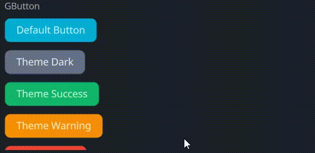

# GButton

A customizable button widget with hover and press animations, configurable colors, cursor behavior, and text properties.

## Example

```rust
use makepad_widgets::*;

live_design! {
    import makepad_widgets::base::*;
    import makepad_widgets::theme_desktop_dark::*; 
    import gen_components::components::*;

    GButtonExample = <ScrollYView>{
        height: 200.0,
        width: Fill,
        flow: Down,
        spacing: 10.0,
        <Label>{
            text: "GButton"
        }
        <GButton>{
            text: "Default Button"
        }
        <GButton>{
            theme: Dark,
            text: "Theme Dark"
        }
        <GButton>{
            theme: Success,
            text: "Theme Success"
        }
        <GButton>{
            theme: Warning,
            text: "Theme Warning"
        }
        <GButton>{
            theme: Error,
            text: "Theme Error",
        }
        <GButton>{
            theme: Error,
            text: "unvisible button!",
            visible: false,
        }
        <GButton>{
            round: true,
            text: "Round Button",
        }
        <GButton>{
            height: 46,
            width: 160,
            theme: Success,
            border_width: 1.4,
            border_color: #FFF,
            border_radius: 11.0,
            text: "Rounded Button!",
        }
        <GButton>{
            theme: Dark,
            border_width: 1.2,
            hover_color: #FF0000,
            pressed_color: #00FF00,
            text: "GButton!",
            font_family: dep("E:/Rust/try/makepad/Gen-UI/examples/gen_widget_example/resources/GoNotoKurrent-Bold.ttf"),
            font_size: 12.0,
            color: #000,
        }
    }
}
```
## Props
|decorate|name|type|description|
|--|--|--|--|
|live|theme|`Themes`|The theme applied to the button.|
|live|background_color|`Option<Vec4>`|The background color of the button.|
|live|hover_color|`Option<Vec4>`|The color of the button when hovered.|
|live|pressed_color|`Option<Vec4>`|The color of the button when pressed.|
|live|border_color|`Option<Vec4>`|The border color of the button.|
|live|border_width|`f32`|The width of the button's border.|
|live|border_radius|`f32`|The radius of the button's border.|
|live|round|`bool`|Whether the button has rounded corners.|
|live|text|`RcStringMut`|The text displayed on the button.|
|live|font_size|`f64`|The font size of the button text.|
|live|color|`Option<Vec4>`|The color of the button text.|
|live|font_family|`LiveDependency`|The font family used for the button text.|
|live|cursor|`Option<MouseCursor>`|The cursor type when hovering over the button.|
|live|visible|`bool`|Whether the button is visible.|
|live|draw_text|`DrawText`|The component used for drawing the button text.|
|live|text_walk|`Walk`|The positioning properties for the button text.|
|live|grab_key_focus|`bool`|Whether the button grabs key focus when clicked.|
|animator|animator|`Animator`|The animation properties for the button.|
|redraw|draw_button|`DrawCard`|The component used for drawing the button.|
|walk|walk|`Walk`|The positioning properties for the button.|
|layout|layout|`Layout`|The layout properties for the button.|

## Event

|name|description|
|--|--|
|Hovered|Triggered when the button is hovered.|
|Clicked|Triggered when the button is clicked.|
|Released|Triggered when the button is released.|
|Pressed|Triggered when the button is pressed.|