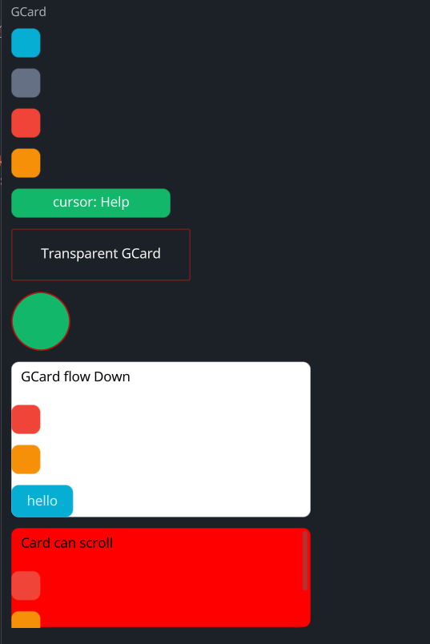

# Card

A customizable card widget with hover and press animations, configurable colors, cursor behavior, and optional scroll bars.

## Example



```rust
use makepad_widgets::*;

live_design! {
    import makepad_widgets::base::*;
    import makepad_widgets::theme_desktop_dark::*; 
    import gen_components::components::*;

    GCardExample = <ScrollYView>{
        height: 660.0,
        width: Fill,
        flow: Down,
        spacing: 10.0,
        <Label>{
            text: "GCard",
        }
        <GCard>{
            height: 30.0,
            width: 30.0,
        }
        <GCard>{
            theme: Dark,
            height: 30.0,
            width: 30.0,
        }
        <GCard>{
            theme: Error,
            height: 30.0,
            width: 30.0,
        }
        <GCard>{
            theme: Warning,
            height: 30.0,
            width: 30.0,
            animator_key: true,
        }
        <GCard>{
            theme: Success,
            height: 30.0,
            width: 160.0,
            cursor: Help,
            align: {x: 0.5, y: 0.5},
            <GLabel>{
                text: "cursor: Help",
            }
        }
        <GCard>{
            theme: Error,
            height: Fit,
            width: 180.0,
            transparent: true,
            border_width: 1.0,
            border_radius: 0.0,
            align: {x: 0.5, y: 0.5},
            <GLabel>{
                margin: 20.0,
                text: "Transparent GCard",
            }
        }
        <GCard>{
            theme: Success,
            height: 60.0,
            width: 60.0,
            border_color: #FF0000,
            border_width: 1.0,
            border_radius: 15.0,
        }
        <GCard>{
            height: Fit,
            width: 300,
            flow: Down,
            background_color: #FFFFFF,
            spacing: 10.0,
            <GLabel>{
                text: "GCard flow Down",
                color: #0,
                margin: 10.0,
            }
            <GCard>{
                theme: Error,
                height: 30.0,
                width: 30.0,
            }
            <GCard>{
                theme: Warning,
                height: 30.0,
                width: 30.0,
            }
            <GButton>{
                text: "hello"
            }
        }
        
        <GCard>{
            height: 100.0,
            width: 300,
            flow: Down,
            background_color: #FF0000,
            spacing: 10.0,
            // transparent: true,
            scroll_bars: <GScrollBars> {}
            <GLabel>{
                text: "Card can scroll",
                color: #0,
                margin: 10.0,
            }
            <GCard>{
                theme: Error,
                height: 30.0,
                width: 30.0,
            }
            <GCard>{
                theme: Warning,
                height: 30.0,
                width: 30.0,
            }
            <GButton>{
                text: "hello"
            }
        }
    }
}
```

## Props
|decorate|name|type|description|
|--|--|--|--|
|live|theme|`Themes`|The theme applied to the card.|
|live|background_color|`Option<Vec4>`|The background color of the card.|
|live|hover_color|`Option<Vec4>`|The color of the card when hovered.|
|live|pressed_color|`Option<Vec4>`|The color of the card when pressed.|
|live|border_color|`Option<Vec4>`|The border color of the card.|
|live|border_width|`f32`|The width of the card's border.|
|live|border_radius|`f32`|The radius of the card's border.|
|live|visible|`bool`|Whether the card is visible.|
|live|transparent|`bool`|Whether the card background is transparent.|
|live|cursor|`Option<MouseCursor>`|The cursor type when hovering over the card.|
|live|animator_key|`bool`|Whether the card uses an animation key.|
|live|scroll_bars|`Option<LivePtr>`|The optional scroll bars for the card.|
|rust|scroll_bars_obj|`Option<Box<ScrollBars>>`|The scroll bars object.|
|live|grab_key_focus|`bool`|Whether the card grabs key focus when clicked.|
|live|block_signal_event|`bool`|Whether the card blocks signal events.|
|live|draw_card|`DrawCard`|The component used for drawing the card.|
|walk|walk|`Walk`|The positioning properties for the card.|
|layout|layout|`Layout`|The layout properties for the card.|
|rust|draw_state|`DrawStateWrap<DrawState>`|The draw state of the card.|
|rust|children|`ComponentMap<LiveId, WidgetRef>`|The children components of the card.|
|rust|draw_order|`Vec<LiveId>`|The draw order of the card's children.|
|live|event_order|`EventOrder`|The event order for the card.|
|rust|defer_walks|`Vec<(LiveId, DeferWalk)>`|The deferred walks for the card.|
|animator|animator|`Animator`|The animation properties for the card.|

## Event

|name|description|
|--|--|
|KeyDown|Triggered when a key is pressed down.|
|KeyUp|Triggered when a key is released.|
|FingerDown|Triggered when a finger touches the card.|
|FingerMove|Triggered when a finger moves over the card.|
|FingerHoverIn|Triggered when a finger hovers over the card.|
|FingerHoverOver|Triggered when a finger moves while hovering over the card.|
|FingerHoverOut|Triggered when a finger stops hovering over the card.|
|FingerUp|Triggered when a finger is lifted from the card.|