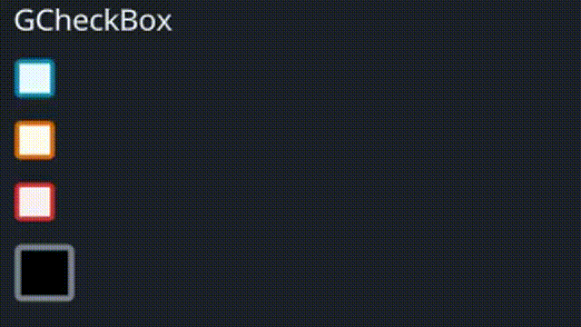

# GCheckBox

A customizable checkbox widget with various properties for appearance, cursor behavior, and animations for different states.
## Example



```rust
use makepad_widgets::*;

live_design! {
    import makepad_widgets::base::*;
    import makepad_widgets::theme_desktop_dark::*; 
    import gen_components::components::*;

    GCheckBoxExample = <ScrollYView>{
        height: 150.0,
        width: Fill,
        spacing: 10.0,
        flow: Down,
        <GLabel>{
            text: "GCheckBox"
        }
        <GCheckBox>{
           
        }
        <GCheckBox>{
            theme: Warning,
            check_type: Tick,
        }
        <GCheckBox>{
            theme: Error,
            check_type: Cross,
        }
        <GCheckBox>{
            theme: Success,
            height: 30.0,
            width: 60.0,
            size: 12.0,
            scale: 0.6,
            border_width: 2.0,
            check_type: Round,
            background_color: #000,
            selected_color: #42A5F5,
            hover_color: #FF7043,
            border_color: #76828F,
        }
        <GCheckBox>{
            theme: Dark,
            height: 30.0,
            width: 60.0,
            size: 12.0,
            check_type: Tick,
        }
        
    }
}
```

## Props
|decorate|name|type|description|
|--|--|--|--|
|live|theme|`Themes`|The theme applied to the checkbox.|
|live|size|`f32`|The size of the checkbox.|
|live|background_color|`Option<Vec4>`|The background color of the checkbox.|
|live|hover_color|`Option<Vec4>`|The color of the checkbox when hovered.|
|live|focus_color|`Option<Vec4>`|The color of the checkbox when focused.|
|live|selected_color|`Option<Vec4>`|The color of the checkbox when selected.|
|live|border_color|`Option<Vec4>`|The border color of the checkbox.|
|live|border_width|`f32`|The width of the checkbox's border.|
|live|scale|`f32`|The scale of the checkbox.|
|live|cursor|`Option<MouseCursor>`|The cursor type when hovering over the checkbox.|
|live|value|`String`|The value associated with the checkbox.|
|live|check_type|`GChooseType`|The type of the checkbox.|
|redraw|draw_check|`DrawGCheckBox`|The component used for drawing the checkbox.|
|walk|walk|`Walk`|The positioning properties for the checkbox.|
|layout|layout|`Layout`|The layout properties for the checkbox.|
|animator|animator|`Animator`|The animation properties for the checkbox.|

## Event
|name|description|
|--|--|
|Changed|Triggered when the checkbox state changes, carrying the new state and associated value.|
|Hover|Triggered when the checkbox is hovered.|

Note: Events with `None` are omitted.