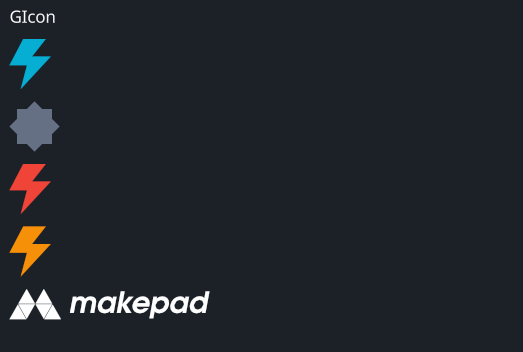

# GIcon

A customizable icon widget that supports various visual properties and animation states.

## Example



```rust
use makepad_widgets::*;

live_design! {
    import makepad_widgets::base::*;
    import makepad_widgets::theme_desktop_dark::*; 
    import gen_components::components::*;

    GIconExample = <ScrollYView>{
        height: 200.0,
        width: Fill,
        spacing: 10.0,
        flow: Down,
        <GLabel>{
            text: "GIcon",
        }
        <GIcon>{
            cursor: Help,
            src: dep("crate://self/resources/lightning.svg"),
        }
        <GIcon>{
            theme: Dark,
            src: dep("crate://self/resources/config.svg"),
        }
        <GIcon>{
            theme: Error,
            src: dep("crate://self/resources/lightning.svg"),
        }
        <GIcon>{
            theme: Warning,
            src: dep("crate://self/resources/lightning.svg"),
        }
        <GIcon>{
            height: 60,
            width: 160,
            cursor: Help,
            color: #fff,
            src: dep("crate://self/resources/logo_makepad.svg"),
        }
        
    }
}
```

## Props
|decorate|name|type|description|
|--|--|--|--|
|live|theme|`Themes`|The theme applied to the icon.|
|live|brightness|`f32`|The brightness of the icon.|
|live|curve|`f32`|The curve effect applied to the icon.|
|live|linearize|`f32`|The linearization factor of the icon.|
|live|src|`LiveDependency`|The source dependency for the icon's image.|
|live|command|`Option<String>`|The SVG path command (TODO).|
|live|scale|`f64`|The scale of the icon.|
|live|color|`Option<Vec4>`|The color of the icon.|
|live|draw_depth|`f32`|The drawing depth of the icon.|
|live|hover_color|`Option<Vec4>`|The color of the icon when hovered.|
|live|cursor|`Option<MouseCursor>`|The cursor type when hovering over the icon.|
|live|visible|`bool`|Visibility of the icon.|
|animator|animator|`Animator`|The animation properties for the icon.|
|redraw|draw_icon|`DrawGIcon`|The component used for drawing the icon.|
|walk|walk|`Walk`|The positioning properties for the icon.|
|layout|layout|`Layout`|The layout properties for the icon.|

## Event
|name|description|
|--|--|
|Clicked|Triggered when the icon is clicked.|
|Hover|Triggered when the icon is hovered.|

Note: Events with `None` are omitted.