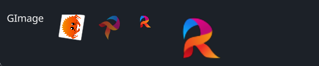

# GImage

A versatile image widget that supports various visual properties, layout, and interactions.

## Example



```rust
use makepad_widgets::*;

live_design! {
    import makepad_widgets::base::*;
    import makepad_widgets::theme_desktop_dark::*; 
    import gen_components::components::*;
    import makepad_draw::shader::std::*;
    GImageExample = <ScrollYView>{
        height: 100.0,
        width: Fill,
        spacing: 20.0,
        <GLabel>{
            text: "GImage",
        }
        <GImage>{
            height: 32.0,
            width: 36.0,
            src: dep("crate://self/resources/rust.png"),
            rotation:30.0,
        }
        <GImage>{
            rotation: 1.0,
            opacity: 0.6,
            src: dep("crate://self/resources/robius.png"),
        }
        <GImage>{
            scale: 0.6,
            src: dep("crate://self/resources/robius.png"),
        }
        <GImage>{
            scale: 2.0,
            src: dep("crate://self/resources/robius.png"),
        }
       
        
    }
}
```

## Props
|decorate|name|type|description|
|--|--|--|--|
|live|visible|`bool`|Visibility of the image.|
|live|opacity|`f32`|The opacity of the image.|
|live|cursor|`Option<MouseCursor>`|The cursor type when hovering over the image.|
|live|scale|`f64`|The scale of the image.|
|live|rotation|`f32`|The rotation angle of the image.|
|walk|walk|`Walk`|The positioning properties for the image.|
|layout|layout|`Layout`|The layout properties for the image.|
|redraw|draw_image|`DrawCard`|The component used for drawing the image.|
|live|src|`LiveDependency`|The source dependency for the image's content.|
|rust|texture|`Option<Texture>`|The texture used for the image. |

## Event
No events specified for this widget.