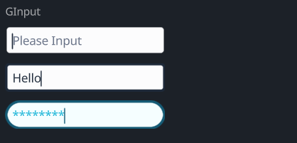

# GInput

The `GInput` widget is a versatile text input field with various visual and interactive properties. It supports themes, customization of colors, borders, text properties, cursor styles, and more.

## Example

```rust
use makepad_widgets::*;

live_design! {
    import makepad_widgets::base::*;
    import makepad_widgets::theme_desktop_dark::*; 
    import gen_components::components::*;

    GInputExample = <ScrollYView>{
        height: 160.0,
        width: Fill,
        spacing: 10.0,
        flow:Down,
        <Label>{
            text: "GInput"
        }
        <GInput>{
            theme: Dark,   
        }
        <GInput>{
            theme: Dark,
            border_width: 2.0,
            // border_radius: 4.0,
            value: "Hello",
            placeholder: "please",
            
        }
        <GInput>{
            border_radius: 8.0,
            border_width: 2.0,
            input_type: Pwd,
        }
    }
}
```

## Props
|decorate|name|type|description|
|--|--|--|--|
|live|theme|`Themes`|The theme of the input field.|
|live|color|`Option<Vec4>`|The color of the text.|
|live|background_color|`Option<Vec4>`|The background color of the input field.|
|live|hover_color|`Option<Vec4>`|The color when the input field is hovered over.|
|live|pressed_color|`Option<Vec4>`|The color when the input field is pressed.|
|live|border_color|`Option<Vec4>`|The color of the border.|
|live|border_width|`f32`|The width of the border.|
|live|border_radius|`f32`|The radius of the border's corners.|
|live|round|`bool`|Whether the border is rounded.|
|live|value|`String`|The current value of the input field.|
|live|placeholder|`String`|The placeholder text for the input field.|
|live|input_type|`GInputType`|The type of input (e.g., text, password).|
|live|disabled|`bool`|Whether the input field is disabled.|
|live|font_size|`f64`|The size of the font.|
|live|brightness|`f32`|The brightness of the text.|
|live|curve|`f32`|The curve property for text rendering.|
|live|top_drop|`f64`|The top drop property for text positioning.|
|live|height_factor|`f64`|The height factor for text rendering.|
|live|wrap|`TextWrap`|The text wrapping mode.|
|live|font_family|`LiveDependency`|The font family used for the text.|
|live|cursor_width|`f64`|The width of the cursor.|
|live|cursor_border_radius|`f64`|The border radius of the cursor.|
|live|cursor_margin_bottom|`f64`|The bottom margin of the cursor.|
|live|cursor_margin_top|`f64`|The top margin of the cursor.|
|live|on_focus_select_all|`bool`|Whether to select all text on focus.|
|rust|cursor_tail|`usize`|The tail position of the cursor.|
|rust|cursor_head|`usize`|The head position of the cursor.|
|redraw|draw_input|`DrawCard`|The component used for drawing the input field.|
|live|draw_select|`DrawCard`|The component used for drawing the selection.|
|live|draw_cursor|`DrawCard`|The component used for drawing the cursor.|
|live|draw_text|`DrawGText`|The component used for drawing the text.|
|rust|undo_id|`u64`|The ID for the undo action.|
|rust|last_undo|`Option<UndoItem>`|The last undo item.|
|rust|undo_stack|`Vec<UndoItem>`|The stack of undo actions.|
|rust|redo_stack|`Vec<UndoItem>`|The stack of redo actions.|
|rust|double_tap_start|`Option<(usize, usize)>`|The start positions for a double tap.|
|walk|walk|`Walk`|The positioning properties for the input field.|
|layout|layout|`Layout`|The layout properties for the input field.|
|animator|animator|`Animator`|The animator for handling animations.|

## Event
|name|description|
|--|--|
|Changed|Triggered when the text changes.|
|Return|Triggered when the return key is pressed.|
|Escape|Triggered when the escape key is pressed.|
|KeyFocus|Triggered when the input field gains focus.|
|KeyFocusLost|Triggered when the input field loses focus.|