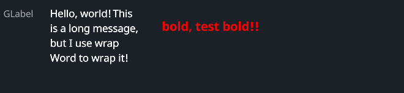

# GLabel

A custom label widget with various configurable properties such as color, font size, brightness, line spacing, and more.

## Example


```rust
use makepad_widgets::*;

live_design! {
    import makepad_widgets::base::*;
    import makepad_widgets::theme_desktop_dark::*; 
    import gen_components::components::*;

    GLabelExample = <ScrollYView>{
        height: 100.0,
        width: Fill,
        spacing: 10.0,
        flow: Down,
        <Label>{
            text: "GLabel"
        }
        <GHLayout>{
            height: Fit,
            width: Fill,
            spacing: 10.0,
            <GLabel>{
                text: "Hello, world! This is a long message, but I use wrap Word to wrap it!",
                height: Fit,
                width: 120.0,
                wrap: Word,
                margin: {left: 12.0},
            }
            <GLabel>{
                text: "test another font family!!",
                font_size: 12.0,
                padding: 16.0,
                color: #FF0000,
                font_family: dep("crate://self/resources/AlimamaFangYuanTiVF-Thin.ttf"),
            }
        }
    }
}
```

## Props

|decorate|name|type|description|
|--|--|--|--|
|live|color|`Vec4`|The color of the label.|
|live|font_size|`f64`|The size of the font used in the label.|
|live|brightness(unused)|`f32`|The brightness level of the text.|
|live|curve(unused)|`f32`|The curve factor of the text.|
|live|line_spacing|`f64`|The line spacing of the text.|
|live|top_drop|`f64`|The top drop of the text.|
|live|height_factor|`f64`|The height factor of the text.|
|live|wrap|`TextWrap`|The text wrapping mode.|
|live|font_family|`LiveDependency`|The font family of the text.|
|live|visible|`bool`|Whether the label is visible.|
|deref|draw_text|`DrawText`|The `DrawText` component used for drawing the text.|
|walk|height|`Size`|The height of the label|
|walk|width|`Size`|The width of the label|
|walk|abs_pos|`Option<DVec2>`|abs position of the component|
|walk|margin|`Margin`|the margin around the component|
|live|align|`Align`|The alignment of the text.|
|live|padding|`Padding`|The padding around the text. default `0.0`|
|live|text|`ArcStringMut`|The content of the label.|

## Event

|name|description|
|--|--|
|None|No events are specified for this widget.