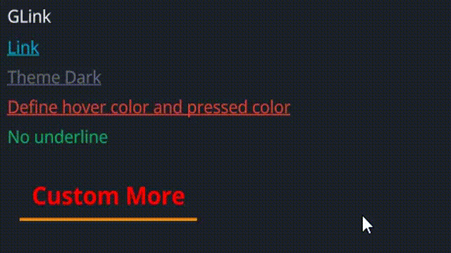

# GLink

A customizable hyperlink widget with hover and press animations, configurable colors, text properties, and cursor behavior.

## Example


```rust
use makepad_widgets::*;

live_design! {
    import makepad_widgets::base::*;
    import makepad_widgets::theme_desktop_dark::*; 
    import gen_components::components::*;

    GLinkExample = <ScrollYView>{
        height: 200.0,
        width: Fill,
        spacing: 10.0,
        flow: Down,
        <GLabel>{
            text: "GLink"
        }
        <GLink>{
            text: "Link",
        }
        <GLink>{
            theme: Dark,
            text: "Theme Dark",
        }
        <GLink>{
            theme: Error,
            text: "Define hover color and pressed color",
            hover_color: #FF00FF,
            pressed_color: #00FF00,
        }
        <GLink>{
            theme: Success,
            text: "No underline",
            underline: false,
        }
        <GLink>{
            theme: Warning,
            text: "Custom More",
            font_size: 14.0,
            hover_color: #FF00FF,
            background_color: #00FF00,
            margin: 10.0,
            padding: 10.0,
            color: #FF0000,
            underline_width: 2.0,
            font_family: dep("E:/Rust/try/makepad/Gen-UI/examples/gen_widget_example/resources/GoNotoKurrent-Bold.ttf"),
        }
        
    }
}
```

## Props

|decorate|name|type|description|
|--|--|--|--|
|live|theme|`Themes`|The theme applied to the link.|
|live|background_color|`Option<Vec4>`|The background color of the link.|
|live|hover_color|`Option<Vec4>`|The color of the link when hovered.|
|live|pressed_color|`Option<Vec4>`|The color of the link when pressed.|
|live|border_color|`Option<Vec4>`|The border color of the link.|
|live|underline|`bool`|Whether the link has an underline.|
|live|underline_color|`Option<Vec4>`|The color of the underline.|
|live|underline_width|`f32`|The width of the underline.|
|live|border_radius|`f32`|The radius of the link's border.|
|live|round|`bool`|Whether the link has rounded borders.|
|live|transparent|`bool`|Whether the link background is transparent.|
|live|text|`RcStringMut`|The text content of the link.|
|live|font_size|`f64`|The size of the font used in the link.|
|live|color|`Option<Vec4>`|The color of the text.|
|live|font_family|`LiveDependency`|The font family of the text.|
|live|cursor|`Option<MouseCursor>`|The cursor type when hovering over the link.|
|live|href|`Option<String>`|The URL that the link points to.|
|live|link_type|`LinkType`|The type of the link (NewTab or SameTab).|
|live|visible|`bool`|Whether the link is visible.|
|live|draw_text|`DrawGText`|The component used for drawing the text.|
|live|text_walk|`Walk`|The positioning properties for the text.|
|live|grab_key_focus|`bool`|Whether the link grabs key focus when clicked.|
|animator|animator|`Animator`|The animation properties for the link.|
|redraw|draw_link|`DrawGLink`|The component used for drawing the link.|
|walk|walk|`Walk`|The positioning properties for the link.|
|layout|layout|`Layout`|The layout properties for the link.|

## Event

|name|description|
|--|--|
|Hovered|Triggered when the link is hovered.|
|Clicked|Triggered when the link is clicked.|
|Released|Triggered when the link is released.|
|Pressed|Triggered when the link is pressed.|