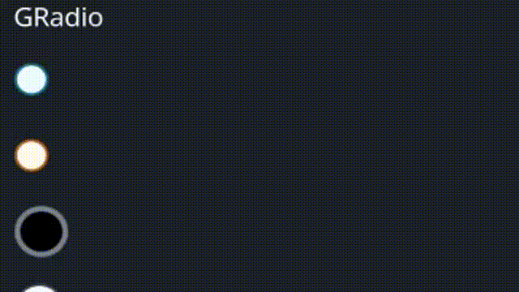

# GRadio

A radio button widget with customizable colors, cursor behavior, and animations for hover and selection states.

## Example



```rust
use makepad_widgets::*;

live_design! {
    import makepad_widgets::base::*;
    import makepad_widgets::theme_desktop_dark::*; 
    import gen_components::components::*;

    GRadioExample = <ScrollYView>{
        height: 150.0,
        width: Fill,
        spacing: 10.0,
        flow: Down,
        <GLabel>{
            text: "GRadio"
        }
        <GRadio>{
            height: 30.0,
            width: 60.0,
        }
        <GRadio>{
            theme: Warning,
            height: 30.0,
            width: 60.0,
            radio_type: Tick,
        }
        <GRadio>{
            theme: Success,
            height: 30.0,
            width: 60.0,
            size: 12.0,
            scale: 0.6,
            border_width: 2.0,
            radio_type: Round,
            background_color: #000,
            selected_color: #42A5F5,
            hover_color: #FF7043,
            border_color: #76828F,
        }
        <GRadio>{
            theme: Dark,
            height: 30.0,
            width: 60.0,
            size: 12.0,
            radio_type: Tick,
        }
        <GRadio>{
            theme: Error,
            height: 30.0,
            width: 60.0,
           
            radio_type: Cross,
        }
    }
}
```

## Props
|decorate|name|type|description|
|--|--|--|--|
|live|theme|`Themes`|The theme applied to the radio button.|
|live|size|`f32`|The size of the radio button.|
|live|background_color|`Option<Vec4>`|The background color of the radio button.|
|live|hover_color|`Option<Vec4>`|The color of the radio button when hovered.|
|live|focus_color|`Option<Vec4>`|The color of the radio button when focused.|
|live|selected_color|`Option<Vec4>`|The color of the radio button when selected.|
|live|border_color|`Option<Vec4>`|The border color of the radio button.|
|live|border_width|`f32`|The width of the radio button's border.|
|live|scale|`f32`|The scale of the radio button.|
|live|cursor|`Option<MouseCursor>`|The cursor type when hovering over the radio button.|
|live|value|`String`|The value associated with the radio button.|
|live|radio_type|`GChooseType`|The type of the radio button.|
|redraw|draw_radio|`DrawGRadio`|The component used for drawing the radio button.|
|walk|walk|`Walk`|The positioning properties for the radio button.|
|layout|layout|`Layout`|The layout properties for the radio button.|
|animator|animator|`Animator`|The animation properties for the radio button.|

## Event
|name|description|
|--|--|
|Clicked|Triggered when the radio button is clicked, carrying the associated value.|
|Hover|Triggered when the radio button is hovered.|

Note: Events with `None` are omitted.