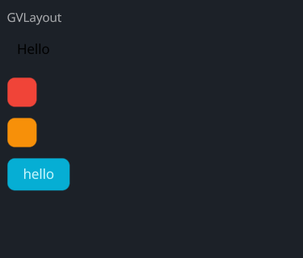

# GVLayout

A vertical layout component use CardBase

## Example



```rust
use makepad_widgets::*;

live_design! {
    import makepad_widgets::base::*;
    import makepad_widgets::theme_desktop_dark::*; 
    import gen_components::components::*;

    GVLayoutExample = <ScrollYView>{
        height: 260.0,
        width: Fill,
        flow: Down,
        spacing: 10.0,
        <Label>{
            text: "GVLayout",
        }
        <GVLayout>{
            height: Fit,
            width: 300,
            background_color: #FFFFFF,
            spacing: 10.0,
            <GLabel>{
                text: "Hello",
                color: #0,
                margin: 10.0,
            }
            <GCard>{
                theme: Error,
                height: 30.0,
                width: 30.0,
            }
            <GCard>{
                theme: Warning,
                height: 30.0,
                width: 30.0,
            }
            <GButton>{
                text: "hello"
            }
        }
    }
}
```