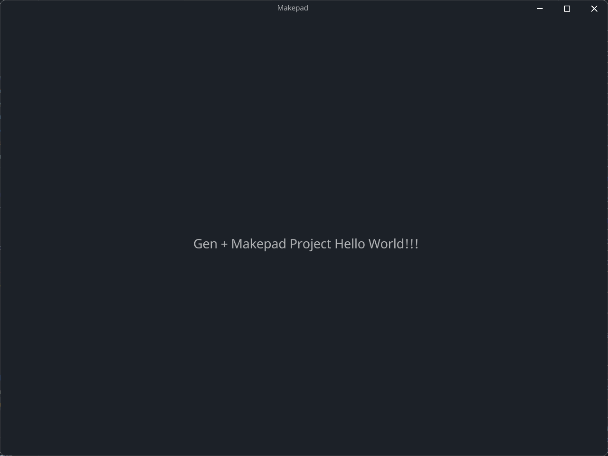
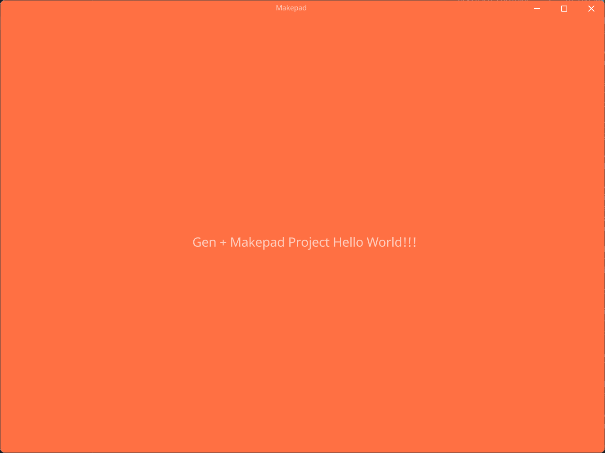
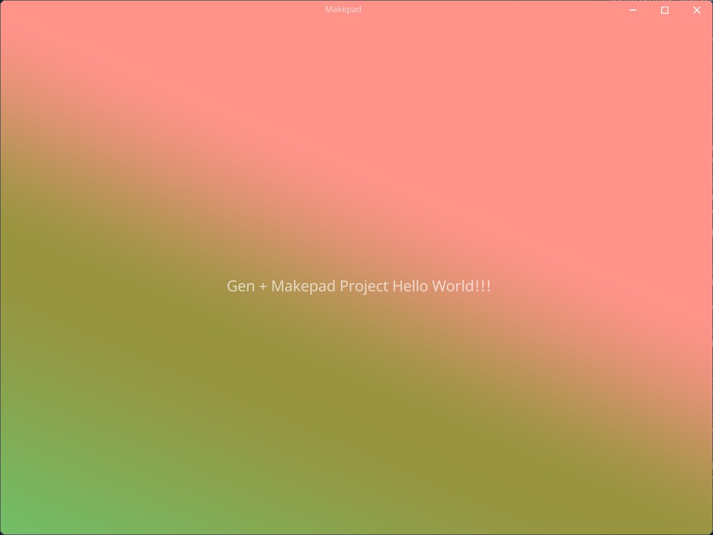
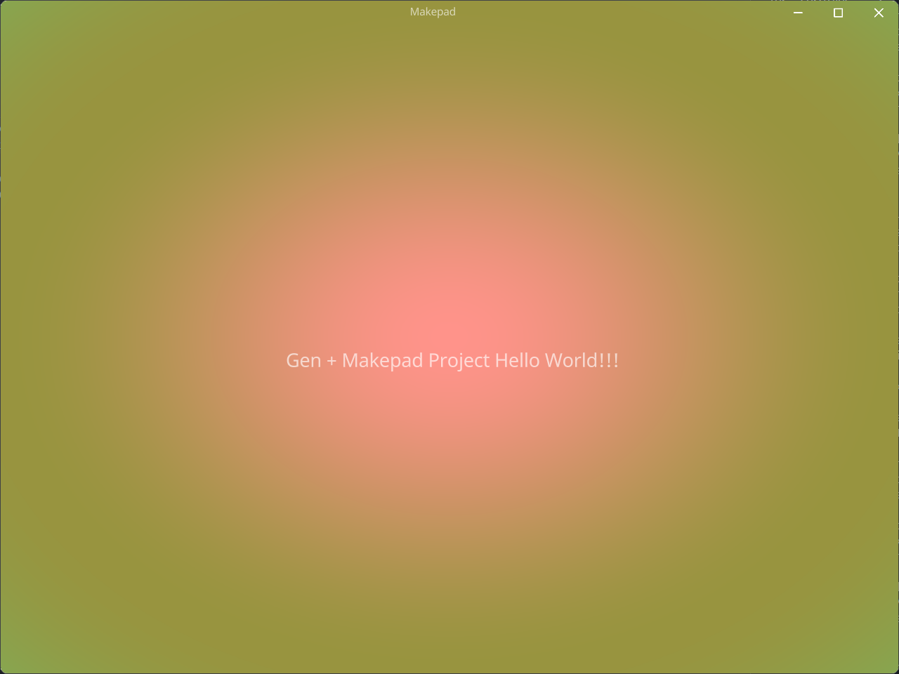
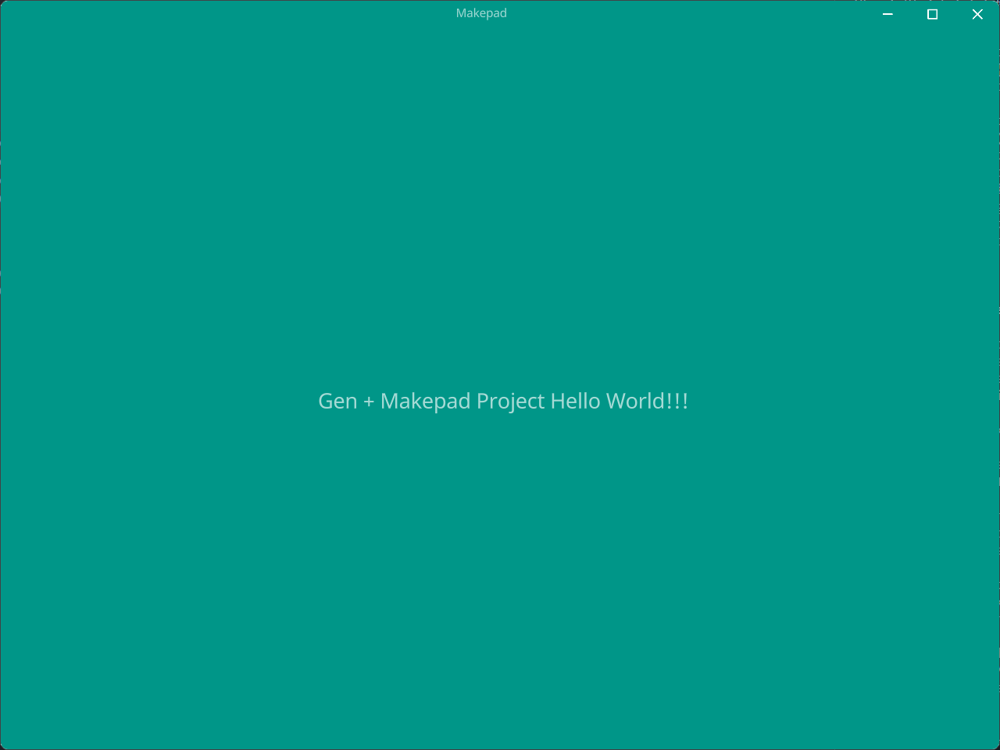

# Color

当前GenUI支持以下几种类型的颜色书写方式:

- Hex: 16进制颜色
- Rgb: rgb类型
- Rgba: rgba带有透明度的rgb类型
- LinearGradient: 线性渐变
- RadialGradient: 径向渐变
- Shader(`#cfg(feature="makepad")`)

## Hex



```css
<style>
#ui{
  #main_window{
    //...
    draw_bg: #1C2128;
  }
}
</style>
```

## Rgb

```css
<style>
#ui{
  #main_window{
    //...
    draw_bg: rgb(255, 112, 67);
  }
}
</style>
```

## Rgba

```css
<style>
#ui{
  #main_window{
    //...
    draw_bg: rgba(255, 112, 67, 0.3);
  }
}
</style>
```

## Linear

```css
<style>
#ui{
  #main_window{
    //...
    draw_bg: linear_gradient(120deg, #FF938A, #98943F 40%, #6BC46D);
  }
}
</style>
```

## Radial

```css
<style>
#ui{
  #main_window{
    //...
    draw_bg: radial_gradient(#FF938A, #98943F, #6BC46D);
  }
}
</style>
```

## Shader

```css
<style>
#ui{
  #main_window{
    //...
    draw_bg: shader(|self|{
      fn pixel(self) -> vec4{
        return #009688
      }
    });
  }
}
</style>
```