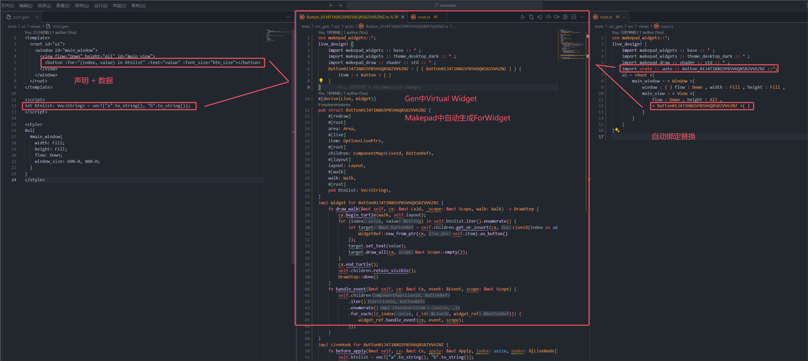

# For

在GenUI中类似于Vue的for循环控制语法，不同的是你无需设置:key，GenUI会帮你自动绑定，for并不像js采用dom复制的方式生成，在makepad中采用自定义组件结合ComponentMap与数据结合进行生成元素节点并渲染，并且在GenUI中采用迭代器绑定，也就是说，任何Rust中的内置的实现了迭代器trait的类型都可以被解析，其中以下语法都被允许：
1. `:for="(index, item) in iter_ident"`
2. `:for="item in iter_ident"`
3. `:for="(index, (item1, item2, ...)) in iter_ident"` flexible iter
4. `:for="(index, ()) in iter_ident"`
5. `:for="(index, _) in iter_ident"`
GenUI会将其处理为虚拟widget并自动生成Makepad的ForWidget（含有ComponentMap来处理子组件循环渲染的自定义Widget），并最终进行绑定替换



## Example1

```rust
<template>
  <component id="RootComponent" inherits="root">
    <window id="main_window">
        <view flow="Down" height="All" id="main_view">
          <label :for="(index, value) in list" :text="value" font_size="16.0"></label>
        </view>
      </window>
  </component>
</template>

<script>
let list: Vec<String> = vec!["Hello".to_string(), "GenUI".to_string()];
</script>

<style>
#ui{
  #main_window{
    width: Fill;
    height: Fill;
    flow: Down;
    window_size: 600.0, 800.0;
  }
}
</style>
```

## Example2

```rust
<template>
  <component id="RootComponent" inherits="root">
    <window id="main_window">
        <view flow="Down" height="All" id="main_view">
          <label :for="(index, value) in list" :text="value" font_size="16.0"></label>
        </view>
      </window>
  </component>
</template>

<script>
let list: [String; 2] = ["Hello".to_string(), "GenUI".to_string()];
</script>

<style>
#ui{
  #main_window{
    width: Fill;
    height: Fill;
    flow: Down;
    window_size: 600.0, 800.0;
  }
}
</style>
```