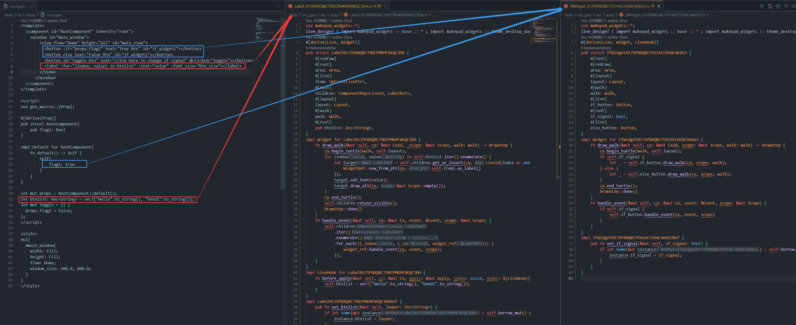
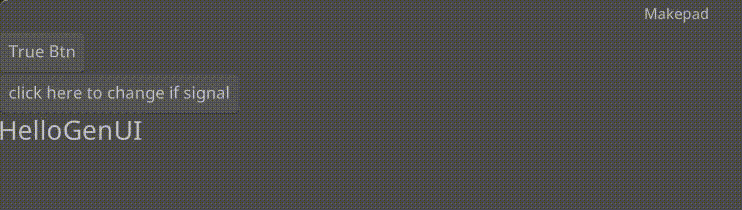

# If

GenUI中if_else同样由数据控制元素节点是否渲染，采用虚拟Widget的方式从模板提取if_else标记的组件，并自动生成Makepad Widget，所以你无需关注如何生成，无需手写自定义组件



## Example



```rust
<template>
  <component id="RootComponent" inherits="root">
    <window id="main_window">
        <view flow="Down" height="All" id="main_view">
          <button :if="props.flag1" text="True Btn" id="if_widget1"></button>
          <button else text="False Btn" id="if_widget1"></button>
          <button id="toggle_btn" text="click here to change if signal" @clicked="toggle"></button>
        </view>
      </window>
  </component>
</template>

<script>
use gen_macros::{Prop};

#[derive(Prop)]
pub struct RootComponent{
    pub flag1: bool
}

impl Default for RootComponent{
    fn default() -> Self {
        Self{
            flag1: true
        }
    }
}

let mut props = RootComponent::default();
let mut toggle = || {
  props.flag1 = false;
};
</script>

<style>
#ui{
  #main_window{
    width: Fill;
    height: Fill;
    flow: Down;
    window_size: 600.0, 800.0;
  }
}
</style>
```