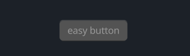
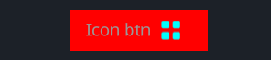
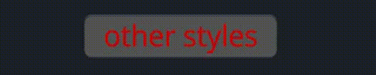

# Button

按钮由文字，图标，形状组成

`Button` consist of text, icon and shape

- Label
  - label_walk
  - draw_text
  - text
- Icon
  - draw_icon
  - icon_walk
- Shape
  - draw_bg
  - walk
  - layout

## Example

### Easy



```rust
<Button>{text: "easy button",}
```
### Icon Button



```rust
<Button>{
    text: "Icon btn",
    // override draw_bg
    draw_bg: {
        fn pixel() -> vec4 { return #FF0000 }
    },
    draw_icon: {
        svg_file: dep("crate://self/icons/all.svg"),
        fn get_color(self) -> vec4 { 
            return #00FFFF
        }
    },
    icon_walk: {
        height: 16,
        width: 16,
        margin: {left: 10.0, right: 10.0},
    }
}
```

### Other Styles Button



```rust
<Button>{
    text: "other styles",
    draw_text: {
        text_style: {
            font_size: 16.0,
            brightness: 0.8,
        },
        fn get_color(self) -> vec4 { 
            // if !hover use #00FFFF else #fff
            // eq: !self.hover ? #00FFFF : #fff 
            // return mix(
            //     #00FFFF,
            //     #fff,
            //     self.hover
            // )
            // !hover ? #FF0000 : (!pressed ? #00FFFF : #0000FF)
            return mix(
                #FF0000,
                mix(
                    #00FFFF,
                    #0000FF,
                    self.pressed
                ),
                self.hover
            )
        }
    },
    padding: {left: 16.0, right: 16.0, top: 6.0, bottom: 6.0},
}
```

## Default

```rust
    Button = <ButtonBase> {
        width: Fit,
        height: Fit,
        margin: {left: 1.0, right: 1.0, top: 1.0, bottom: 1.0}
        align: {x: 0.5, y: 0.5}
        padding: {left: 14.0, top: 10.0, right: 14.0, bottom: 10.0}

        label_walk: {
            width: Fit,
            height: Fit
        }

        draw_text: {
            instance hover: 0.0
            instance pressed: 0.0
            text_style: <THEME_FONT_LABEL>{
                font_size: 11.0
            }
            fn get_color(self) -> vec4 {
                return mix(
                    mix(
                        #9,
                        #c,
                        self.hover
                    ),
                    #9,
                    self.pressed
                )
            }
        }

        draw_icon: {
            instance hover: 0.0
            instance pressed: 0.0
            fn get_color(self) -> vec4 {
                return mix(
                    mix(
                        #9,
                        #c,
                        self.hover
                    ),
                    #9,
                    self.pressed
                )
            }
        }

        draw_bg: {
            instance hover: 0.0
            instance pressed: 0.0
            uniform border_radius: 3.0
            instance bodytop: #53
            instance bodybottom: #5c
            fn pixel(self) -> vec4 {
                let sdf = Sdf2d::viewport(self.pos * self.rect_size);
                let grad_top = 5.0;
                let grad_bot = 1.0;
                let body = mix(mix(self.bodytop, self.bodybottom, self.hover), #33, self.pressed);
                let body_transp = vec4(body.xyz, 0.0);
                let top_gradient = mix(body_transp, mix(#6d, #1f, self.pressed), max(0.0, grad_top - sdf.pos.y) / grad_top);
                let bot_gradient = mix(
                    mix(body_transp, #5c, self.pressed),
                    top_gradient,
                    clamp((self.rect_size.y - grad_bot - sdf.pos.y - 1.0) / grad_bot, 0.0, 1.0)
                );

                // the little drop shadow at the bottom
                let shift_inward = self.border_radius + 4.0;
                sdf.move_to(shift_inward, self.rect_size.y - self.border_radius);
                sdf.line_to(self.rect_size.x - shift_inward, self.rect_size.y - self.border_radius);
                sdf.stroke(
                    mix(mix(#2f, #1f, self.hover), #0000, self.pressed),
                    self.border_radius
                )

                sdf.box(
                    1.,
                    1.,
                    self.rect_size.x - 2.0,
                    self.rect_size.y - 2.0,
                    self.border_radius
                )
                sdf.fill_keep(body)

                sdf.stroke(
                    bot_gradient,
                    1.0
                )

                return sdf.result
            }
        }

        animator: {
            hover = {
                default: off,
                off = {
                    from: {all: Forward {duration: 0.1}}
                    apply: {
                        draw_bg: {pressed: 0.0, hover: 0.0}
                        draw_icon: {pressed: 0.0, hover: 0.0}
                        draw_text: {pressed: 0.0, hover: 0.0}
                    }
                }

                on = {
                    from: {
                        all: Forward {duration: 0.1}
                        pressed: Forward {duration: 0.01}
                    }
                    apply: {
                        draw_bg: {pressed: 0.0, hover: [{time: 0.0, value: 1.0}],}
                        draw_icon: {pressed: 0.0, hover: [{time: 0.0, value: 1.0}],}
                        draw_text: {pressed: 0.0, hover: [{time: 0.0, value: 1.0}],}
                    }
                }

                pressed = {
                    from: {all: Forward {duration: 0.2}}
                    apply: {
                        draw_bg: {pressed: [{time: 0.0, value: 1.0}], hover: 1.0,}
                        draw_icon: {pressed: [{time: 0.0, value: 1.0}], hover: 1.0,}
                        draw_text: {pressed: [{time: 0.0, value: 1.0}], hover: 1.0,}
                    }
                }
            }
        }
    }
```