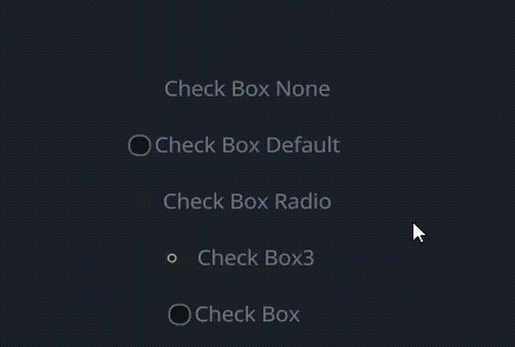

# CheckBox

## Example



```rust
 // None
 <CheckBox>{
     text: "Check Box None",
     draw_check: {
         check_type: None,
     },
 } 
 <CheckBox>{
     text: "Check Box Default",
 }
 // look like Radio, but it can be clicked multiple times
 // Radio only can be clicked once
 <CheckBox>{
     text: "Check Box Radio",
     draw_check: {
         check_type: Radio,
     },
 }
 // look like Switch
 <CheckBox>{
     text: "Check Box3",
     draw_check: {
         check_type: Toggle,
     },
     label_walk: {
         margin: {left: 32.0},
     },
 }
 <CheckBox>{
     text: "Check Box",
     draw_check: {
         check_type: Check,
     },
 } 
```

## Default

```rust
    CheckBox = <CheckBoxBase> {

        width: Fit,
        height: Fit

        label_walk: {
            margin: {left: 20.0, top: 8, bottom: 8, right: 10}
            width: Fit,
            height: Fit,
        }

        label_align: {
            y: 0.0
        }

        draw_check: {
            uniform size: 7.0;
            fn pixel(self) -> vec4 {
                let sdf = Sdf2d::viewport(self.pos * self.rect_size)
                match self.check_type {
                    CheckType::Check => {
                        let left = 3;
                        let sz = self.size;
                        let c = vec2(left + sz, self.rect_size.y * 0.5);
                        sdf.box(left, c.y - sz, sz * 2.0, sz * 2.0, 3.0); // rounding = 3rd value
                        sdf.fill_keep(mix(mix(#x00000077, #x00000044, pow(self.pos.y, 1.)), mix(#x000000AA, #x00000066, pow(self.pos.y, 1.0)), self.hover))
                        sdf.stroke(#x888, 1.0) // outline
                        let szs = sz * 0.5;
                        let dx = 1.0;
                        sdf.move_to(left + 4.0, c.y);
                        sdf.line_to(c.x, c.y + szs);
                        sdf.line_to(c.x + szs, c.y - szs);
                        sdf.stroke(mix(#fff0, #f, self.selected), 1.25);
                    }
                    CheckType::Radio => {
                        let sz = self.size;
                        let left = sz + 1.;
                        let c = vec2(left + sz, self.rect_size.y * 0.5);
                        sdf.circle(left, c.y, sz);
                        sdf.fill(#2);
                        let isz = sz * 0.5;
                        sdf.circle(left, c.y, isz);
                        sdf.fill(mix(#fff0, #f, self.selected));
                    }
                    CheckType::Toggle => {
                        let sz = self.size;
                        let left = sz + 1.;
                        let c = vec2(left + sz, self.rect_size.y * 0.5);
                        sdf.box(left, c.y - sz, sz * 3.0, sz * 2.0, 0.5 * sz);
                        sdf.fill(#2);
                        let isz = sz * 0.5;
                        sdf.circle(left + sz + self.selected * sz, c.y, isz);
                        sdf.circle(left + sz + self.selected * sz, c.y, 0.5 * isz);
                        sdf.subtract();
                        sdf.circle(left + sz + self.selected * sz, c.y, isz);
                        sdf.blend(self.selected)
                        sdf.fill(#f);
                    }
                    CheckType::None => {
                        return #0000
                    }
                }
                return sdf.result
            }
        }
        draw_text: {
            color: #9,
            instance focus: 0.0
            instance selected: 0.0
            instance hover: 0.0
            text_style: {
                font: {
                    //path: d"resources/IBMPlexSans-SemiBold.ttf"
                }
                font_size: 11.0
            }
            fn get_color(self) -> vec4 {
                return mix(
                    mix(
                        #fff6,
                        #fff6,
                        self.hover
                    ),
                    #fff6,
                    self.selected
                )
            }
        }

        draw_icon: {
            instance focus: 0.0
            instance hover: 0.0
            instance selected: 0.0
            fn get_color(self) -> vec4 {
                return mix(
                    mix(
                        #9,
                        #c,
                        self.hover
                    ),
                    #f,
                    self.selected
                )
            }
        }

        animator: {
            hover = {
                default: off
                off = {
                    from: {all: Forward {duration: 0.15}}
                    apply: {
                        draw_check: {hover: 0.0}
                        draw_text: {hover: 0.0}
                        draw_icon: {hover: 0.0}
                    }
                }
                on = {
                    from: {all: Snap}
                    apply: {
                        draw_check: {hover: 1.0}
                        draw_text: {hover: 1.0}
                        draw_icon: {hover: 1.0}
                    }
                }
            }
            focus = {
                default: off
                off = {
                    from: {all: Snap}
                    apply: {
                        draw_check: {focus: 0.0}
                        draw_text: {focus: 0.0}
                        draw_icon: {focus: 0.0}
                    }
                }
                on = {
                    from: {all: Snap}
                    apply: {
                        draw_check: {focus: 1.0}
                        draw_text: {focus: 1.0}
                        draw_icon: {focus: 1.0}
                    }
                }
            }
            selected = {
                default: off
                off = {
                    from: {all: Forward {duration: 0.1}}
                    apply: {
                        draw_check: {selected: 0.0},
                        draw_text: {selected: 0.0},
                        draw_icon: {selected: 0.0},
                    }
                }
                on = {
                    from: {all: Forward {duration: 0.0}}
                    apply: {
                        draw_check: {selected: 1.0}
                        draw_text: {selected: 1.0}
                        draw_icon: {selected: 1.0},
                    }
                }
            }
        }
    }
```