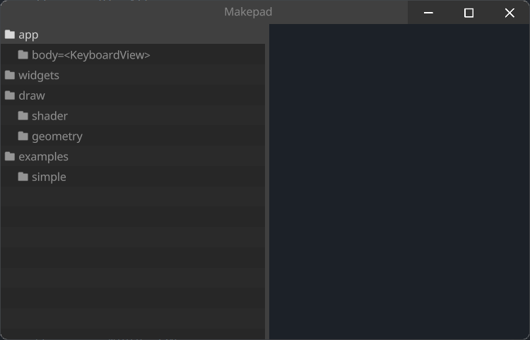

# Designer

Makepad中的`Designer`组件可用于各种场景，主要用于Makepad框架内的UI开发和设计。以下是使用`Designer`部件有益的一些特定情况：

1. **初始UI开发**：
   - 启动新项目时，`设计器`组件有助于设置应用程序的初始布局和结构。
   - 您可以使用可视化界面快速创建和组织应用程序的主要组件和布局。

2. **组件设计与定制**：
   - 在设计自定义UI组件时，`设计器`允许交互式编辑和即时反馈。
   - 它可用于微调单个组件的外观和行为，动态调整大小、颜色和布局等特性。

3. **原型和实验**：
    - `Designer`组件非常适合制作新的UI想法的原型并尝试不同的布局和样式。
    - 您可以快速迭代设计思想，进行更改并立即看到结果，而无需编写大量代码。

4. **UI优化**：
   - 对于现有项目，`设计器`可用于细化和优化UI。
   - 使用可视化编辑器可以更容易地调整视觉元素、改善用户体验和确保整个应用程序的一致性。

5. **学习与探索**：
   - 对于Makepad框架的新用户，`Designer`组件提供了一种直观的方式来学习和探索Makepad小部件和布局的功能。
   - 它有助于理解不同的属性和组件如何在Makepad环境中相互作用。

6. **协同设计**：
   - 在团队环境中，`设计器`可用于协作设计会话。
   - 设计人员和开发人员可以一起调整UI，共享想法，并实时实现更改

The `Designer` component in Makepad can be used in various scenarios, primarily focused on UI development and design within the Makepad framework. Here are some specific situations where using the `Designer` component is beneficial:

1. **Initial UI Development**:
    - When starting a new project, the `Designer` component helps set up the initial layout and structure of the application.
    - You can quickly create and organize the main components and layout of your application using the visual interface.

2. **Component Design and Customization**:
    - When designing custom UI components, the `Designer` allows for interactive editing and immediate feedback.
    - It’s useful for fine-tuning the appearance and behavior of individual components, adjusting properties like size, color, and layout dynamically.

3. **Prototyping and Experimentation**:
    - The `Designer` component is excellent for prototyping new UI ideas and experimenting with different layouts and styles.
    - You can rapidly iterate on design ideas, making changes and seeing results instantly without writing extensive code.

4. **UI Refinement and Optimization**:
    - For existing projects, the `Designer` can be used to refine and optimize the UI.
    - Adjustments to the visual elements, improving the user experience, and ensuring consistency across the application are made easier with the visual editor.

5. **Learning and Exploration**:
    - For new users of the Makepad framework, the `Designer` component provides an intuitive way to learn and explore the capabilities of Makepad widgets and layouts.
    - It helps in understanding how different properties and components interact within the Makepad environment.

6. **Collaborative Design**:
    - In a team setting, the `Designer` can be used for collaborative design sessions.
    - Designers and developers can work together to adjust the UI, share ideas, and implement changes in real-time.

## Example



```rust
use makepad_widgets::*;
       
live_design!{
    import makepad_widgets::base::*;
    import makepad_widgets::theme_desktop_dark::*; 
    
    App = {{App}} {
        ui: <Root>{
            main_window = <Window>{
                block_signal_event: true;
                window: {inner_size: vec2(600, 400)},
                pass: {clear_color: #1C2128},   
                <Designer>{}
            }
        }
    }
}  
```

## Default

```rust
Designer = <DesignerBase>{
        flow: Right
        <Splitter> {
            align: FromA(300),
            a: <View> {
                designer_outline = <DesignerOutline> {
                    outline_tree = <OutlineTree>{
                        
                    }
                }
            },
            b: <View> {
                dpi_factor: 1.5
                draw_bg: {color: #4}
                width: Fill, height: Fill
                flow: Down
                designer_view = <DesignerView> {
                    
                }
            },
        }   
    }
```