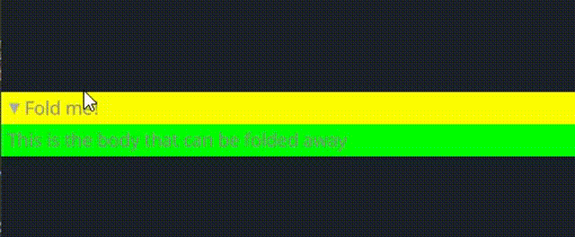

# FoldHeader

`FoldHeader`由两个部分组成:

`FoldHeader` consist of two parts:

- header
- body

## Example

在示例中就是你所需要的

It is what you really need in this example



```rust
<FoldHeader>{
    header: <View>{
        show_bg: true,
        width: Fill  
        height: Fit           
        draw_bg: {
            fn pixel(self) -> vec4{
                return #FFFF00
            }
        }        
        padding: 5,
        flow: Right, 
        <FoldButton>{} 
        <Label>{text: "Fold me!"} 
    }
    body: <View>{
        show_bg: true,
        width: Fill  
        height: Fit            
        draw_bg: {
            fn pixel(self) -> vec4{
                return #00FF00
            }
        }        
        padding: 5,
        <Label>{
            text:"This is the body that can be folded away"
        }
    }
}
```

## Default

```rust
    FoldHeader = <FoldHeaderBase> {
        width: Fill,
        height: Fit
        body_walk: {
            width: Fill,
            height: Fit
        }

        flow: Down,

        animator: {
            open = {
                default: on
                off = {
                    from: {all: Forward {duration: 0.2}}
                    ease: ExpDecay {d1: 0.96, d2: 0.97}
                    redraw: true
                    apply: {
                        opened: [{time: 0.0, value: 1.0}, {time: 1.0, value: 0.0}]
                    }
                }
                on = {
                    from: {all: Forward {duration: 0.2}}
                    ease: ExpDecay {d1: 0.98, d2: 0.95}
                    redraw: true
                    apply: {
                        opened: [{time: 0.0, value: 0.0}, {time: 1.0, value: 1.0}]
                    }
                }
            }
        }
    }
```