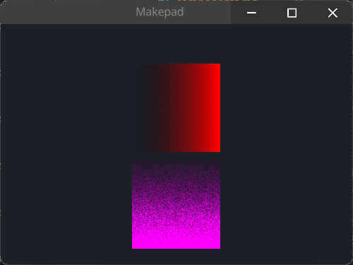

# GradientView

下面展示`GradientXView`和`GradientYView`的示例

The following display example for `GradientXView` and `GradientYView`

## Example



默认的渐变色是红色，若需要修改渐变色则需要修内部`instance color2`进行修改，See Example `<GradientYView>`

the default gradient color is red, if you want to change, you need to set `instance color2`, See Example `<GradientYView>`

```rust
use makepad_widgets::*;
       
live_design!{
    import makepad_widgets::base::*;
    import makepad_widgets::theme_desktop_dark::*; 
    
    App = {{App}} {
        ui: <Root>{
            main_window = <Window>{
                block_signal_event: true;
                window: {inner_size: vec2(400, 300)},
                pass: {clear_color: #1C2128},   
                <SolidView>{
                    height: All,
                    width: Fill,
                    flow: Down,
                    align: {x: 0.5, y: 0.5},
                    spacing: 10,
                    <GradientXView>{
                        height: 100,
                        width: 100,
                    }
                    <GradientYView>{
                        height: 100,
                        width: 100,
                        draw_bg: {
                            // 渐变颜色
                            // gradient color
                            instance color2: #f0f,
                            instance dither: 10.5
                        }
                    }
                }
            }
        }
    }
}  
```