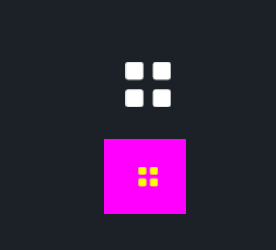

# Icon

`Icon`是一个svg图标，它只允许您使用svg文件，如果您想使用其他图像类型，See [Image](./image.md) 

`Icon` is a svg icon, it only allow you use svg file, if you wanna use other image types, See [Image](./image.md)  

## Example



```rust
<Icon>{
    draw_icon: {
        svg_file: dep("crate://self/icons/all.svg"),
    }
}

<Icon>{
    draw_icon: {
        svg_file: dep("crate://self/icons/all.svg"),
        brightness: 1.2,
        // same as: `color: #dddd00,`
        fn get_color(self)-> vec4{
            return #dddd00
        },
        // size 95% of the original
        scale: 0.95,
    },
    draw_bg: {
        fn pixel(self)-> vec4{
            return #FF00FF
        }
    },
    icon_walk:{
        height: 16,
        width: Fit,
    }
    height: 60,
    width: 66,
    margin: 16,
    padding: 8,
    // move icon to the container center
    align: {x:0.5, y:0.5},
}
```

## Default

```rust
    Icon = <IconBase> {
        width: Fit,
        height: Fit,

        icon_walk: {
            margin: {left: 5.0},
            width: Fit,
            height: Fit,
        }

        draw_bg: {
            instance color: #0000,
            fn pixel(self) -> vec4 {
                return self.color;
            }
        }
    }
```