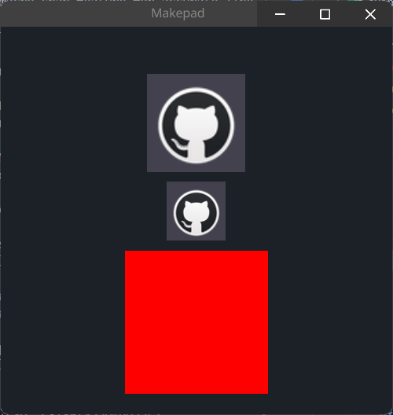

# Image

当前图片组件支持`jpg`和`png`两种类型的文件，不允许使用`svg`，如果你要使用`svg`, See [Icon](./icon.md)

Current `Image` support `jpg` and `png` file, but it not allow `svg`, if you want use `svg`, See [Icon](./icon.md)

## Example

```rust
<Image>{
    source: dep("crate://self/icons/github.png"),
}
<Image>{
    height: 60,
    width: Fit,
    source: dep("crate://self/icons/github.png"),
    fit: Vertical,
}
<Image>{
    height: 46,
    width: 146,
    source: dep("crate://self/icons/github.png"),
    // biggest make image size overflow
    fit: Biggest,
    // if you use draw_bg it will cover the image
    draw_bg: {
        fn pixel(self)-> vec4{
            return #FF0000
        },
    },
}
```

## Default

```rust
    Image = <ImageBase> {
        width: 100
        height: 100
        
        draw_bg: {
            texture image: texture2d
            instance opacity: 1.0
            instance image_scale: vec2(1.0, 1.0)
            instance image_pan: vec2(0.0, 0.0)
            
            fn get_color_scale_pan(self, scale: vec2, pan: vec2) -> vec4 {
                return sample2d(self.image, self.pos * scale + pan).xyzw;
            }
            
            fn get_color(self) -> vec4 {
                return self.get_color_scale_pan(self.image_scale, self.image_pan)
            }
            
            fn pixel(self) -> vec4 {
                let color = self.get_color();
                return Pal::premul(vec4(color.xyz, color.w * self.opacity))
            }
        }
    }
```