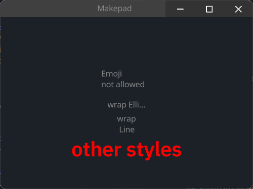

# Label

默认的Label带有自适应自身大小的高和宽，`#888888`的颜色以及超长自动换行

Default Label has Fit height and width, color is `#888888` and Text auto wrap

```rust
Label = <LabelBase> {
    width: Fit
    height: Fit
    draw_text: {
        color: #8,
        text_style: <THEME_FONT_LABEL>{}
        wrap: Word
    }
}
```

## Example



### Easy Label
```rust
<Label>{
    height: 30,
    // if width is not set, it will be calculated based on the text length
    // if width < text length, text will be truncated
    // you can use `\n`... to format the text
    width: 80,
    margin: 10,
    text: "Emoji \nnot allowed",
}
```
### Text Wrap
```rust
<Label>{
    width: 60,
    text: "wrap Ellipsis",
    draw_text: {
        wrap: Ellipsis,
    }
}
// if wrap is Word, text will be wrapped by word when text length > width
// if is Line, no wrap
<Label>{
    width: 30,
    height: 30,
    text: "wrap Line",
    draw_text: {
        wrap: Word,
    }
}
```
### Other Styles
```rust
<Label>{
    draw_text: {
        wrap: Word,
        // real font size = font size * font scale
        font_scale: 1.5,
        text_style: {
            // so here font size = 16 * 1.5 = 24
            font_size: 16,
            font: {path: dep("crate://makepad-widgets/resources/IBMPlexSans-SemiBold.ttf")},
            // brightness > 1.0 will make the text brighter
            // < 1.0 will make the text darker
            brightness: 1.0,
        },
        color: #FF0000,
    }
    text: "other styles",
}
```