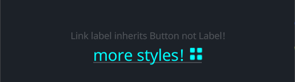

# LinkLabel

`LinkLabel` inherits `Button`, so you can set any properties like `Button`

## Example



```rust
<LinkLabel>{
    text: "Link label inherits Button not Label!",
}
// you can add icon too
<LinkLabel>{
    text: "more styles!",
    draw_icon: {
        svg_file: dep("crate://self/icons/all.svg"),
        fn get_color(self) -> vec4 { 
            return #00FFFF
        }
    },
    icon_walk: {
        height: 16,
        width: Fit,
        margin: {left: 10.0}
    },
    draw_text: {
        text_style: {
            font_size: 16,
        },
        fn get_color(self) -> vec4 { 
            return #00FFFF
        }
    }
}
```

## Default
```rust
LinkLabel = <LinkLabelBase> {
        width: Fit,
        height: Fit,
        margin: 0
        padding: 0
        align: {x: 0., y: 0.}

        label_walk: {
            width: Fit,
            height: Fit
        }

        draw_icon: {
            instance hover: 0.0
            instance pressed: 0.0
            fn get_color(self) -> vec4 {
                return mix(
                    mix(
                        #9,
                        #c,
                        self.hover
                    ),
                    #9,
                    self.pressed
                )
            }
        }

        animator: {
            hover = {
                default: off,
                off = {
                    from: {all: Forward {duration: 0.1}}
                    apply: {
                        draw_bg: {pressed: 0.0, hover: 0.0}
                        draw_icon: {pressed: 0.0, hover: 0.0}
                        draw_text: {pressed: 0.0, hover: 0.0}
                    }
                }

                on = {
                    from: {
                        all: Forward {duration: 0.1}
                        pressed: Forward {duration: 0.01}
                    }
                    apply: {
                        draw_bg: {pressed: 0.0, hover: [{time: 0.0, value: 1.0}],}
                        draw_icon: {pressed: 0.0, hover: [{time: 0.0, value: 1.0}],}
                        draw_text: {pressed: 0.0, hover: [{time: 0.0, value: 1.0}],}
                    }
                }

                pressed = {
                    from: {all: Forward {duration: 0.2}}
                    apply: {
                        draw_bg: {pressed: [{time: 0.0, value: 1.0}], hover: 1.0,}
                        draw_icon: {pressed: [{time: 0.0, value: 1.0}], hover: 1.0,}
                        draw_text: {pressed: [{time: 0.0, value: 1.0}], hover: 1.0,}
                    }
                }
            }
        }


        draw_bg: {
            instance pressed: 0.0
            instance hover: 0.0
            fn pixel(self) -> vec4 {
                let sdf = Sdf2d::viewport(self.pos * self.rect_size);
                let offset_y = 1.0
                sdf.move_to(0., self.rect_size.y - offset_y);
                sdf.line_to(self.rect_size.x, self.rect_size.y - offset_y);
                return sdf.stroke(mix(
                    THEME_COLOR_TEXT_DEFAULT,
                    THEME_COLOR_TEXT_META,
                    self.pressed
                ), mix(0.0, 0.8, self.hover));
            }
        }

        draw_text: {
            wrap: Word
            instance pressed: 0.0
            instance hover: 0.0
            text_style: <THEME_FONT_LABEL>{}
            fn get_color(self) -> vec4 {
                return mix(
                    mix(
                        THEME_COLOR_TEXT_META,
                        THEME_COLOR_TEXT_DEFAULT,
                        self.hover
                    ),
                    THEME_COLOR_TEXT_META,
                    self.pressed
                )
            }
        }

    }
```