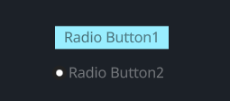

# RadioButton

## Example

```rust
<RadioButton>{
    label: "Radio Button1",
    
    draw_radio: {
        radio_type: Tab,
    }
}
<RadioButton>{
    label: "Radio Button2",
    label_align: {x: 1.5, y: 0.5},
    label_walk: {
        margin: {left: 16.0}
    }
}
```
## Default

```rust
    RadioButton = <RadioButtonBase> {

        draw_radio: {

            uniform size: 7.0;
            uniform color_active: #00000000
            uniform color_inactive: #x99EEFF

            fn pixel(self) -> vec4 {
                let sdf = Sdf2d::viewport(self.pos * self.rect_size)
                match self.radio_type {
                    RadioType::Round => {
                        let sz = self.size;
                        let left = sz + 1.;
                        let c = vec2(left + sz, self.rect_size.y * 0.5);
                        sdf.circle(left, c.y, sz);
                        sdf.fill(#2);
                        let isz = sz * 0.5;
                        sdf.circle(left, c.y, isz);
                        sdf.fill(mix(#fff0, #f, self.selected));
                    }
                    RadioType::Tab => {
                        let sz = self.size;
                        let left = 0.;
                        let c = vec2(left, self.rect_size.y);
                        sdf.rect(
                            -1.,
                            0.,
                            self.rect_size.x + 2.0,
                            self.rect_size.y
                        );
                        sdf.fill(mix(self.color_inactive, self.color_active, self.selected));
                    }
                }
                return sdf.result
            }
        }
        draw_text: {
            instance hover: 0.0
            instance focus: 0.0
            instance selected: 0.0

            uniform color_unselected: #x00000088
            uniform color_unselected_hover: #x000000CC
            uniform color_selected: #xFFFFFF66

            color: #9
            text_style: {
                font: {
                    //path: d"resources/ibmplexsans-semibold.ttf"
                }
                font_size: 9.5
            }
            fn get_color(self) -> vec4 {
                return mix(
                    mix(
                        self.color_unselected,
                        self.color_unselected_hover,
                        self.hover
                    ),
                    self.color_selected,
                    self.selected
                )
            }
        }

        draw_icon: {
            instance focus: 0.0
            instance hover: 0.0
            instance selected: 0.0
            fn get_color(self) -> vec4 {
                return mix(
                    mix(
                        #9,
                        #c,
                        self.hover
                    ),
                    #9,
                    self.selected
                )
            }
        }

        width: Fit,
        height: Fit

        label_walk: {
            margin: {top: 4.5, bottom: 4.5, left: 8, right: 8}
            width: Fit,
            height: Fit,
        }

        label_align: {
            y: 0.0
        }

        animator: {
            hover = {
                default: off
                off = {
                    from: {all: Forward {duration: 0.15}}
                    apply: {
                        draw_radio: {hover: 0.0}
                        draw_text: {hover: 0.0}
                        draw_icon: {hover: 0.0}
                    }
                }
                on = {
                    from: {all: Snap}
                    apply: {
                        draw_radio: {hover: 1.0}
                        draw_text: {hover: 1.0}
                        draw_icon: {hover: 1.0}
                    }
                }
            }
            focus = {
                default: off
                off = {
                    from: {all: Forward {duration: 0.0}}
                    apply: {
                        draw_radio: {focus: 0.0}
                        draw_text: {focus: 0.0}
                        draw_icon: {focus: 0.0}
                    }
                }
                on = {
                    from: {all: Snap}
                    apply: {
                        draw_radio: {focus: 1.0}
                        draw_text: {focus: 1.0}
                        draw_icon: {focus: 1.0}
                    }
                }
            }
            selected = {
                default: off
                off = {
                    from: {all: Forward {duration: 0.0}}
                    apply: {
                        draw_radio: {selected: 0.0}
                        draw_icon: {selected: 0.0}
                        draw_text: {selected: 0.0}
                        draw_icon: {selected: 0.0}
                    }
                }
                on = {
                    cursor: Arrow,
                    from: {all: Forward {duration: 0.0}}
                    apply: {
                        draw_radio: {selected: 1.0}
                        draw_icon: {selected: 1.0}
                        draw_text: {selected: 1.0}
                        draw_icon: {selected: 1.0}
                    }
                }
            }
        }
    }
```