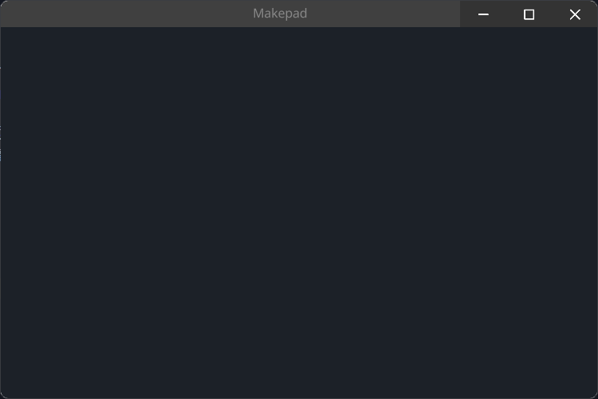

# Root

Root组件中包含一个名叫`design_window`的`Window`组件，因此当我们在使用的时候不可以再声明一个同名的`Window`组件，而Root组件中需要一个Window组件来开启一个窗口。


The Root component contains a `Window` component called `design_window`, so we cannot declare another `Window` component with the same name when using it. The Root component requires a Window component to open a window.

## Example



```rust
use makepad_widgets::*;
       
live_design!{
    import makepad_widgets::base::*;
    import makepad_widgets::theme_desktop_dark::*; 
    
    App = {{App}} {
        ui: <Root>{
            main_window = <Window>{
                block_signal_event: true;
                window: {inner_size: vec2(600, 400)},
                pass: {clear_color: #1C2128},   
            }
        }
    }
}  
```

## Default

```rust
    Root = <RootBase>{
        design_window = <Window>{
            window:{kind_id: 1}
            show_bg: true
            // fill screen
            width: Fill,
            height: Fill
            // make bg color       
            draw_bg: {
                fn pixel(self) -> vec4 {
                    let pos = self.geom_pos * self.rect_size*0.1;
                    let mask = floor(mod(pos.x+floor(mod(pos.y, 2.0)), 2.0))
                    return #3+mask*#04
                }
            }
            designer = <Designer>{
                
            }
        }
    }
```

See [Window](./window.md)

See [Designer](./designer.md)

