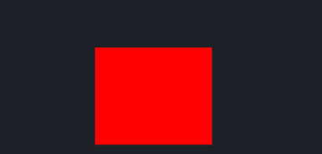
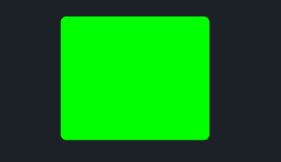
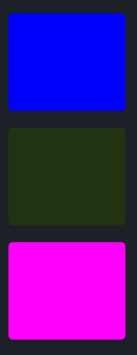

# ShapeView

带有形状的视图类型的组件

The View components with shape

## RectView

一个直接显示颜色的矩形的视图

A Rectangle View which directly show background color

```rust
    RectView = <ViewBase> {
        show_bg: true, 
        draw_bg: {
            instance border_width: 0.0
            instance border_color: #0000
            instance inset: vec4(0.0, 0.0, 0.0, 0.0)
            
            fn get_color(self) -> vec4 {
                return self.color
            }
            
            fn get_border_color(self) -> vec4 {
                return self.border_color
            }
            
            fn pixel(self) -> vec4 {
                let sdf = Sdf2d::viewport(self.pos * self.rect_size);
                sdf.rect(
                    self.inset.x + self.border_width,
                    self.inset.y + self.border_width,
                    self.rect_size.x - (self.inset.x + self.inset.z + self.border_width * 2.0),
                    self.rect_size.y - (self.inset.y + self.inset.w + self.border_width * 2.0)
                )
                sdf.fill_keep(self.get_color())
                if self.border_width > 0.0 {
                    sdf.stroke(self.get_border_color(), self.border_width)
                }
                return sdf.result
            }
        }
    }
```

### Example



```rust
use makepad_widgets::*;
       
live_design!{
    import makepad_widgets::base::*;
    import makepad_widgets::theme_desktop_dark::*; 
    
    App = {{App}} {
        ui: <Root>{
            main_window = <Window>{
                block_signal_event: true;
                window: {inner_size: vec2(400, 300)},
                pass: {clear_color: #1C2128},   
                <SolidView>{
                    height: All,
                    flow: Down,
                    align: {x: 0.5, y: 0.5},
                    <RectView>{
                        height: 100,
                        width: 120,
                        draw_bg: {color: #FF0000},
                    }
                }
            }
        }
    }
}
```

## RoundedView

一个带有`2.5px`圆角的视图(`border-radius: 2.5px`)

A view with rounded corners of `2.5px` (`border-radius: 2.5px`)

```rust
    RoundedView = <ViewBase> {
        show_bg: true, 
        draw_bg: {
            instance border_width: 0.0
            instance border_color: #0000
            instance inset: vec4(0.0, 0.0, 0.0, 0.0)
            instance radius: 2.5
            
            fn get_color(self) -> vec4 {
                return self.color
            }
            
            fn get_border_color(self) -> vec4 {
                return self.border_color
            }
            
            fn pixel(self) -> vec4 {
                let sdf = Sdf2d::viewport(self.pos * self.rect_size)
                sdf.box(
                    self.inset.x + self.border_width,
                    self.inset.y + self.border_width,
                    self.rect_size.x - (self.inset.x + self.inset.z + self.border_width * 2.0),
                    self.rect_size.y - (self.inset.y + self.inset.w + self.border_width * 2.0),
                    max(1.0, self.radius)
                )
                sdf.fill_keep(self.get_color())
                if self.border_width > 0.0 {
                    sdf.stroke(self.get_border_color(), self.border_width)
                }
                return sdf.result;
            }
        }
    }
```

### Example


```rust
use makepad_widgets::*;
       
live_design!{
    import makepad_widgets::base::*;
    import makepad_widgets::theme_desktop_dark::*; 
    
    App = {{App}} {
        ui: <Root>{
            main_window = <Window>{
                block_signal_event: true;
                window: {inner_size: vec2(400, 300)},
                pass: {clear_color: #1C2128},   
                <SolidView>{
                    height: All,
                    flow: Down,
                    align: {x: 0.5, y: 0.5},
                    <RoundedView>{
                        height: 100,
                        width: 120,
                        draw_bg: {color: #00FF00},
                    }
                }
            }
        }
    }
}
```

## RoundedXView|RoundedYView|RoundedAllView

- RoundedXView: `radius: {left: 2.5px, right: 2.5px}`
- RoundedYView: `radius: {top: 2.5px, bottom: 2.5px}`
- RoundedAllView: `radius: {top: 2.5px, right: 2.5px, bottom: 2.5px, left: 2.5px}`

<strong style="color: #FF0000">
X, Y似乎有些问题，并没有像想象那样工作，这是个待修复的工作(todo!)<br><br>
X, Y seems to have some issues and doesn't work as expected. This is a job that needs to be fixed (todo!)
</strong>

