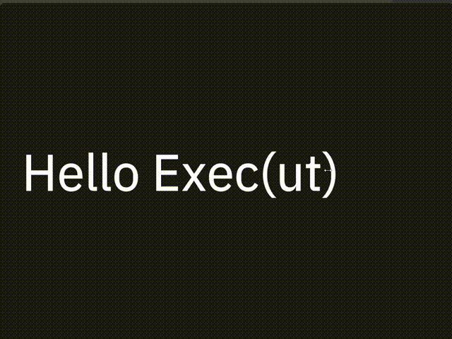

# Slide

`SlidesView`提供了可使用键盘方向切换视图的能力，通常来说它由多个`Slide`组合而成

实际上`Slide`就是一个视图，而`SlideBody`只是一个文字组件，因此你不必拘泥于此

`SlidesView` provides the ability to switch views using keyboard orientation, typically consisting of multiple combinations of slides

Actually, `Slide` is just a view, while `SlideBody` is just a text component, so you don't have to be limited to it
## Example



```rust
<SlidesView> {
    <Slide> {
        title = {text: " Hello Exec(ut)"},
        <SlideBody> {text: ""}
    }
    <Slide> {
        title = {text: "Playing with local AI"},
        <SlideBody> {text: "Rik Arends\n"}
    }
    <Slide> {
        title = {text:"Makepad"},
        <SlideBody> {text: "- Rebuilding VB/Delphi\n   in Rust"}
    }                    
    <Slide> {
        title = {text: "10 years is a long time"},
        <SlideBody> {text: "- Whole stack from scratch"}
    }
}
```


## Default

### SlidesView

```rust
SlidesView = <SlidesViewBase> {
        anim_speed: 0.9
    }
```
### Slide

```rust
Slide = <RoundedView> {
        draw_bg: {color: #x1A, radius: 5.0}
        width: Fill,
        height: Fill
        align: {x: 0.0, y: 0.5} flow: Down, spacing: 10, padding: 50
        title = <Label> {
            draw_text: {
                color: #f
                text_style: {
                    line_spacing:1.0
                    font:{path: dep("crate://makepad-widgets/resources/IBMPlexSans-Text.ttf")}
                    font_size: 84
                }
            }
            text: "SlideTitle"
        }
    }
```
### SlideBody

```rust
SlideBody = <Label> {
        margin:{top:20}
        draw_text: {
            color: #D
            text_style: {
                line_spacing:1.5
                font:{path: dep("crate://makepad-widgets/resources/IBMPlexSans-Text.ttf")}
                font_size: 35
            }
        }
        text: ""
    }
```