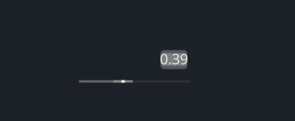

# Slider

## Example



```rust
<Slider> {
    width: 100,
    height: 30, 
    draw_slider:{
        slider_type: Horizontal
    },
} 
```

## Default

```rust
Slider = <SliderBase> {
        min: 0.0,
        max: 1.0,
        step: 0.0,

        draw_slider: {
            instance hover: float
            instance focus: float
            instance drag: float

            fn pixel(self) -> vec4 {
                let slider_height = 3;
                let nub_size = mix(3, 4, self.hover);
                let nubbg_size = 18

                let sdf = Sdf2d::viewport(self.pos * self.rect_size)

                let slider_bg_color = mix(#38, #30, self.focus);
                let slider_color = mix(mix(#5, #68, self.hover), #68, self.focus);
                let nub_color = mix(mix(#8, #f, self.hover), mix(#c, #f, self.drag), self.focus);
                let nubbg_color = mix(#eee0, #8, self.drag);

                match self.slider_type {
                    SliderType::Horizontal => {
                        sdf.rect(0, self.rect_size.y - slider_height, self.rect_size.x, slider_height)
                        sdf.fill(slider_bg_color);

                        sdf.rect(0, self.rect_size.y - slider_height, self.slide_pos * (self.rect_size.x - nub_size) + nub_size, slider_height)
                        sdf.fill(slider_color);

                        let nubbg_x = self.slide_pos * (self.rect_size.x - nub_size) - nubbg_size * 0.5 + 0.5 * nub_size;
                        sdf.rect(nubbg_x, self.rect_size.y - slider_height, nubbg_size, slider_height)
                        sdf.fill(nubbg_color);

                        // the nub
                        let nub_x = self.slide_pos * (self.rect_size.x - nub_size);
                        sdf.rect(nub_x, self.rect_size.y - slider_height, nub_size, slider_height)
                        sdf.fill(nub_color);
                    }
                    SliderType::Vertical => {

                    }
                    SliderType::Rotary => {

                    }
                }
                return sdf.result
            }
        }

        draw_text: {
            color: #9
        }

        label_walk: {
            margin: {left: 4.0, top: 3.0}
            width: Fill,
            height: Fill
        }

        label_align: {
            y: 0.0
        }

        precision: 2,

        text_input: <TextInput> {
            cursor_margin_bottom: 3.0,
            cursor_margin_top: 4.0,
            select_pad_edges: 3.0
            cursor_size: 2.0,
            empty_message: "0",
            numeric_only: true,
            draw_bg: {
                shape: None
                color: #5
                radius: 2.0
            },

            padding: 0,
            label_align: {y: 0.},
            margin: {top: 3, right: 3}
        }

        animator: {
            hover = {
                default: off
                off = {
                    from: {all: Forward {duration: 0.2}}
                    apply: {
                        draw_slider: {hover: 0.0}
                        //text_input: {animator: {hover = off}}
                    }
                }
                on = {
                    //cursor: Arrow,
                    from: {all: Snap}
                    apply: {
                        draw_slider: {hover: 1.0}
                        //text_input: {animator: {hover = on}}
                    }
                }
            }
            focus = {
                default: off
                off = {
                    from: {all: Forward {duration: 0.0}}
                    apply: {
                        draw_slider: {focus: 0.0}
                    }
                }
                on = {
                    from: {all: Snap}
                    apply: {
                        draw_slider: {focus: 1.0}
                    }
                }
            }
            drag = {
                default: off
                off = {
                    from: {all: Forward {duration: 0.1}}
                    apply: {draw_slider: {drag: 0.0}}
                }
                on = {
                    cursor: Arrow,
                    from: {all: Snap}
                    apply: {draw_slider: {drag: 1.0}}
                }
            }
        }
    }
```