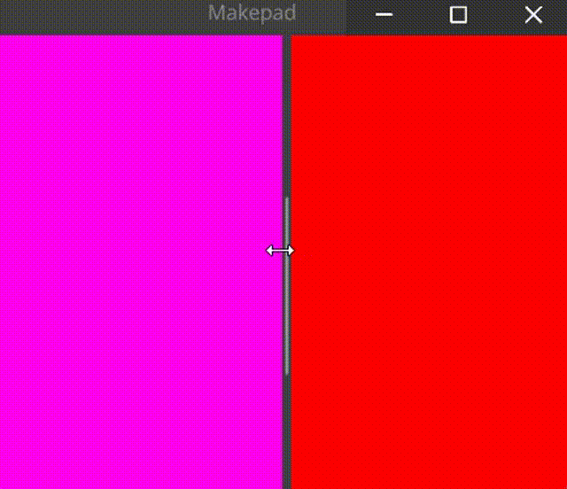
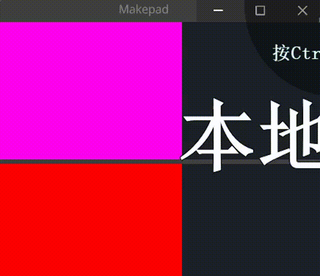

# Splitter

一个可调节的分割器

an adjustable splitter

## Example
### Horizontal

```rust
<Splitter>{
    align: FromA(100),
    a: <View>{
        height: Fill,
        width: 200,
        show_bg: true,
        draw_bg: {color: #FF00F0},
    },
    b: <View>{
        height: Fill,
        width: 200,
        show_bg: true,
        draw_bg: {color: #FF0000},
    }
}
```
### Vertical

```rust
<Splitter>{
    // align: FromB(100),
    // same as align: FromA(20% * a.width),
    align: Weighted(0.5),
    axis: Vertical,
    a: <View>{
        height: Fill,
        width: 200,
        show_bg: true,
        draw_bg: {color: #FF00F0},
    },
    b: <View>{
        height: Fill,
        width: 200,
        show_bg: true,
        draw_bg: {color: #FF0000},
    }
}
```

## Default

```rust
    const THEME_TAB_HEIGHT = 26.0,
    const THEME_SPLITTER_SIZE = 5.0
    const THEME_SPLITTER_HORIZONTAL = 16.0,
    const THEME_SPLITTER_MIN_HORIZONTAL = (THEME_TAB_HEIGHT),
    const THEME_SPLITTER_MAX_HORIZONTAL = (THEME_TAB_HEIGHT + THEME_SPLITTER_SIZE),
    const THEME_SPLITTER_MIN_VERTICAL = (THEME_SPLITTER_HORIZONTAL),
    const THEME_SPLITTER_MAX_VERTICAL = (THEME_SPLITTER_HORIZONTAL + THEME_SPLITTER_SIZE),
    Splitter = <SplitterBase> {
        draw_splitter: {
            uniform border_radius: 1.0
            uniform splitter_pad: 1.0
            uniform splitter_grabber: 110.0

            instance pressed: 0.0
            instance hover: 0.0

            fn pixel(self) -> vec4 {
                let sdf = Sdf2d::viewport(self.pos * self.rect_size);
                sdf.clear(THEME_COLOR_BG_APP);

                if self.is_vertical > 0.5 {
                    sdf.box(
                        self.splitter_pad,
                        self.rect_size.y * 0.5 - self.splitter_grabber * 0.5,
                        self.rect_size.x - 2.0 * self.splitter_pad,
                        self.splitter_grabber,
                        self.border_radius
                    );
                }
                else {
                    sdf.box(
                        self.rect_size.x * 0.5 - self.splitter_grabber * 0.5,
                        self.splitter_pad,
                        self.splitter_grabber,
                        self.rect_size.y - 2.0 * self.splitter_pad,
                        self.border_radius
                    );
                }
                return sdf.fill_keep(mix(
                    THEME_COLOR_BG_APP,
                    mix(
                        THEME_COLOR_CONTROL_HOVER,
                        THEME_COLOR_CONTROL_PRESSED,
                        self.pressed
                    ),
                    self.hover
                ));
            }
        }
        split_bar_size: (THEME_SPLITTER_SIZE)
        min_horizontal: (THEME_SPLITTER_MIN_HORIZONTAL)
        max_horizontal: (THEME_SPLITTER_MAX_HORIZONTAL)
        min_vertical: (THEME_SPLITTER_MIN_VERTICAL)
        max_vertical: (THEME_SPLITTER_MAX_VERTICAL)

        animator: {
            hover = {
                default: off
                off = {
                    from: {all: Forward {duration: 0.1}}
                    apply: {
                        draw_splitter: {pressed: 0.0, hover: 0.0}
                    }
                }

                on = {
                    from: {
                        all: Forward {duration: 0.1}
                        state_down: Forward {duration: 0.01}
                    }
                    apply: {
                        draw_splitter: {
                            pressed: 0.0,
                            hover: [{time: 0.0, value: 1.0}],
                        }
                    }
                }

                pressed = {
                    from: {all: Forward {duration: 0.1}}
                    apply: {
                        draw_splitter: {
                            pressed: [{time: 0.0, value: 1.0}],
                            hover: 1.0,
                        }
                    }
                }
            }
        }
    }
```