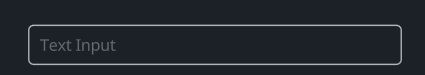
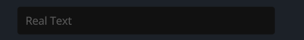
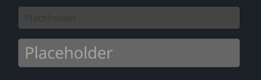

# TextInput

## Example
### With Border

```rust
<TextInput> {
    width: 300, 
    height: Fit,
    text: "Text Input",
    draw_bg: {
        border_width: 1.0
        border_color: #ddd
    }
}
```
### With Background

```rust
<TextInput>{
    text: "Real Text"
    width: 300,
    height: Fit
    draw_bg: {
        color: #1
    }
}
```
### Secret Input


```rust
<TextInput> {
    height: Fit,
    width: 300,
    secret: true,
    empty_message: "Placeholder"
    draw_bg: {
        color:  #444
        border_width: 1.0
        border_color: #x00000044
    }
    ascii_only: true,
}
```
### More Styles



- empty_message is placeholder, if text is not set, show empty_message
- ascii_only is true can only input ascii (a~z, A~Z, 0~9)
```rust
<TextInput> {
    height: Fit,
    width: 300,
    empty_message: "Placeholder"
    draw_bg: {
        color:  #444
        border_width: 1.0
        border_color: #x00000044
    }
    ascii_only: true,
}
<TextInput> {
    height: Fit,
    width: 300,
    margin: {top: 0.0, left: 0.0, bottom: 0.0, right: 0.0},
    empty_message: "Placeholder"
    draw_bg: {
        color: #666,
        border_width: 1.0,
        border_color: #x00000044,
    }
    draw_text: {
        text_style: {font_size: 16.0}
        fn get_color(self) -> vec4 {
            return
            mix(
                mix(
                    mix(
                        #xFFFFFF55,
                        #xFFFFFF88,
                        self.hover
                    ),
                    #xFFFFFFCC,
                    self.focus
                ),
                #xFFFFFF66,
                self.is_empty
            )
        }
    }
}
```

## Default

```rust
    TextInput = <TextInputBase> {
        draw_text: {
            instance hover: 0.0
            instance focus: 0.0
            wrap: Word,
            text_style: <THEME_FONT_LABEL> {}
            fn get_color(self) -> vec4 {
                return
                mix(
                    mix(
                        mix(
                            #xFFFFFF55,
                            #xFFFFFF88,
                            self.hover
                        ),
                        #xFFFFFFCC,
                        self.focus
                    ),
                    #3,
                    self.is_empty
                )
            }
        }

        draw_cursor: {
            instance focus: 0.0
            uniform border_radius: 0.5
            fn pixel(self) -> vec4 {
                let sdf = Sdf2d::viewport(self.pos * self.rect_size);
                sdf.box(
                    0.,
                    0.,
                    self.rect_size.x,
                    self.rect_size.y,
                    self.border_radius
                )
                sdf.fill(mix(#ccc0, #f, self.focus));
                return sdf.result
            }
        }

        draw_select: {
            instance hover: 0.0
            instance focus: 0.0
            uniform border_radius: 2.0
            fn pixel(self) -> vec4 {
                //return mix(#f00,#0f0,self.pos.y)
                let sdf = Sdf2d::viewport(self.pos * self.rect_size);
                sdf.box(
                    0.,
                    0.,
                    self.rect_size.x,
                    self.rect_size.y,
                    self.border_radius
                )
                sdf.fill(mix(#5550, #xFFFFFF40, self.focus)); // Pad color
                return sdf.result
            }
        }

        cursor_margin_bottom: 3.0,
        cursor_margin_top: 4.0,
        select_pad_edges: 3.0
        cursor_size: 2.0,
        numeric_only: false,
        on_focus_select_all: false,
        empty_message: "0",
        draw_bg: {
            instance radius: 2.0
            instance border_width: 0.0
            instance border_color: #3
            instance inset: vec4(0.0, 0.0, 0.0, 0.0)

            fn get_color(self) -> vec4 {
                return self.color
            }

            fn get_border_color(self) -> vec4 {
                return self.border_color
            }

            fn pixel(self) -> vec4 {
                let sdf = Sdf2d::viewport(self.pos * self.rect_size)
                sdf.box(
                    self.inset.x + self.border_width,
                    self.inset.y + self.border_width,
                    self.rect_size.x - (self.inset.x + self.inset.z + self.border_width * 2.0),
                    self.rect_size.y - (self.inset.y + self.inset.w + self.border_width * 2.0),
                    max(1.0, self.radius)
                )
                sdf.fill_keep(self.get_color())
                if self.border_width > 0.0 {
                    sdf.stroke(self.get_border_color(), self.border_width)
                }
                return sdf.result;
            }
        },
        clip_x: false,
        clip_y: false,
        padding: {left: 10, top: 11, right: 10, bottom: 10}
        label_align: {y: 0.}
        //margin: {top: 5, right: 5}
        width: Fit,
        height: Fit,

        /*label_walk: {
            width: Fit,
            height: Fit,
            //margin: 0//{left: 5.0, right: 5.0, top: 0.0, bottom: 2.0},
        }*/

        animator: {
            hover = {
                default: off
                off = {
                    from: {all: Forward {duration: 0.1}}
                    apply: {
                        draw_select: {hover: 0.0}
                        draw_text: {hover: 0.0}
                    }
                }
                on = {
                    from: {all: Snap}
                    apply: {
                        draw_select: {hover: 1.0}
                        draw_text: {hover: 1.0}
                    }
                }
            }
            focus = {
                default: off
                off = {
                    from: {all: Snap}
                    apply: {
                        draw_cursor: {focus: 0.0},
                        draw_select: {focus: 0.0}
                        draw_text: {focus: 0.0}
                    }
                }
                on = {
                    from: {all: Snap}
                    apply: {
                        draw_cursor: {focus: 1.0},
                        draw_select: {focus: 1.0}
                        draw_text: {focus: 1.0}
                    }
                }
            }
        }
    }
```