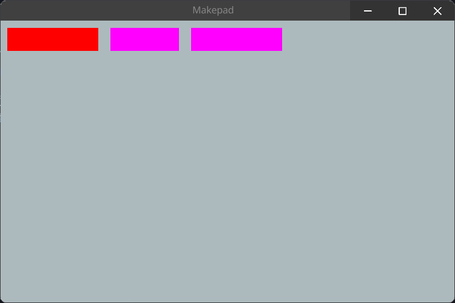
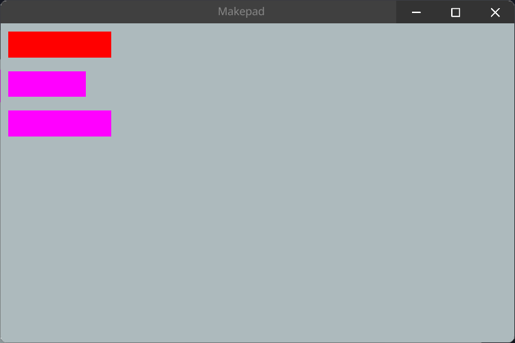
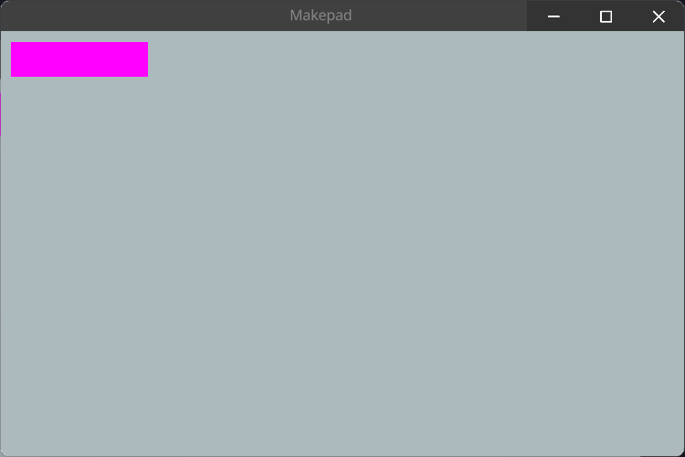
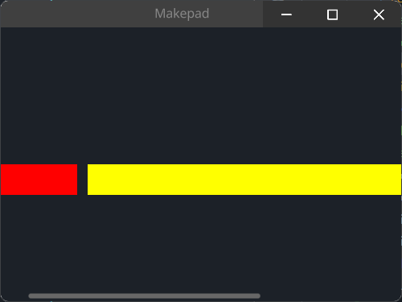
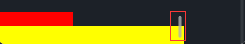
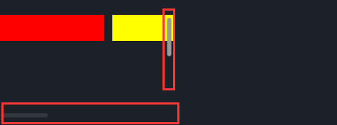

# View

View是一个最基础的视图组件，其他视图组件有: `ScrollXYView`, `ScrollXView`, `ScrollYView` 等

View is the most basic view component, and other view components include: `ScrollXYView`, `ScrollXView`, `ScrollYView` ...

## Example

```rust
use makepad_widgets::*;
       
live_design!{
    import makepad_widgets::base::*;
    import makepad_widgets::theme_desktop_dark::*; 
    
    App = {{App}} {
        ui: <Root>{
            main_window = <Window>{
                block_signal_event: true;
                window: {inner_size: vec2(600, 400)},
                pass: {clear_color: #1C2128},
                <View>{
                    show_bg: true,
                    // inherits parent width
                    width: All,
                    // inherits parent height
                    height: All,
                    padding: 10.0,
                    spacing: 16.0,
                    draw_bg: {color: #ADBABD},
                    flow: Right,
                    <View>{
                        height: 30,
                        width: 120,
                        show_bg: true,
                        draw_bg: {color: #FF0000},
                    }
                    <View>{
                        height: 30,
                        width: 90,
                        show_bg: true,
                        draw_bg: {color: #FF00FF},
                    }
                    <View>{
                        height: 30,
                        width: 120,
                        show_bg: true,
                        draw_bg: {color: #FF00FF},
                    }
                }
            }
        }
    }
}  
 
```

### flow Right

### flow Down

### flow Overlay



## SolidView

SolidView是一个简单的View组件，它继承父组件的背景色，除此外并没有什么特别的

SolidView is a simple View component that inherits the background color of the parent component, without any special features
```rust
SolidView = <ViewBase> {
    show_bg: true, 
    draw_bg: {
        fn get_color(self) -> vec4 {
            return self.color
        }
        
        fn pixel(self) -> vec4 {
            return Pal::premul(self.get_color())
        }
    }
}
```

### Example

在例子中SolidView和View一样，都可以去设置需要的属性，我们也可以去覆盖`draw_bg`属性

In the example, SolidView and View can both set the required properties, and we can also override the `draw_bg` property

```rust
<SolidView>{
    height: 100,
    width: 100,
    draw_bg: {color: #FF0000},
}
```

## ScrollXView

ScrollXView组件是一个带有横向ScrollBar的视图组件

The ScrollXView component is a view component with a horizontal ScrollBar
```rust
ScrollXView = <ViewBase> {
    scroll_bars: <ScrollBars> {show_scroll_x: true, show_scroll_y: false}
}
```

### Example



```rust
<ScrollXView>{
    height: Fill,
    width: Fill,
    spacing: 10,
    <View>{
        height: 30,
        width: 120,
        show_bg: true,
        draw_bg: {color: #FF0000},
    }
    <View>{
        height: 30,
        width: 420,
        show_bg: true,
        draw_bg: {color: #FFFF00},
    }
    <View>{
        height: 80,
        width: 120,
        show_bg: true,
        draw_bg: {color: #FF00FF},
    }
}
```

## ScrollYView

ScrollYView组件是一个带有纵向ScrollBar的视图组件

ScrollYView component is a view component with a vertical ScrollBar

```rust
ScrollYView = <ViewBase> {
    scroll_bars: <ScrollBars> {show_scroll_x: false, show_scroll_y: true}
}
```

### Example



```rust
use makepad_widgets::*;

live_design!{
    import makepad_widgets::base::*;
    import makepad_widgets::theme_desktop_dark::*; 

    SYViewExample = <ScrollYView>{
        height: 80,
        width: 300,
        flow: Down,
        <View>{
            height: 30,
            width: 120,
            show_bg: true,
            draw_bg: {color: #FF0000},
        }
        <View>{
            height: 30,
            width: 420,
            show_bg: true,
            draw_bg: {color: #FFFF00},
        }
        <View>{
            height: 80,
            width: 120,
            show_bg: true,
            draw_bg: {color: #FF00FF},
        }
    }
}
```

## ScrollXYView

ScrollXYView组件是一个同时带有纵向和横向ScrollBar的视图组件

The ScrollXYView component is a view component with both a horizontal and a vertical ScrollBar

```rust
ScrollXYView = <ViewBase> {
    scroll_bars: <ScrollBars> {show_scroll_x: true,show_scroll_y: true}
}
```
### Example



```rust
use makepad_widgets::*;

live_design!{
    import makepad_widgets::base::*;
    import makepad_widgets::theme_desktop_dark::*; 

    SXYViewExample = <ScrollXYView>{
        height: 120,
        width: 200,
        spacing: 10,
        <View>{
            height: 30,
            width: 120,
            show_bg: true,
            draw_bg: {color: #FF0000},
        }
        <View>{
            height: 30,
            width: 420,
            show_bg: true,
            draw_bg: {color: #FFFF00},
        }
        <View>{
            height: 280,
            width: 120,
            show_bg: true,
            draw_bg: {color: #FF00FF},
        }
    }
}
```