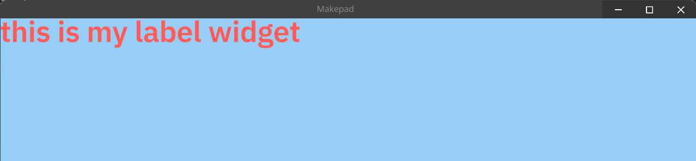

# Defining a Widget in Makepad

In this chapter, we'll delve into the creation of a `MyLabel` Widget, which extends the capabilities of the built-in `Label` widget in Makepad.

## Starting with a New Module

First, create a new module for our custom widget:

```rust
pub mod my_label;
```

## Crafting a Live Design

The `live_design!` macro allows for an effortless and succinct definition of custom widgets. Here, we define `MyLabel` with unique styling:

```rust
use makepad_widgets::*;

live_design!{
    import makepad_widgets::base::*;
    import makepad_widgets::theme_desktop_dark::*;

    MyLabel = {{MyLabel}}{
        draw_text:{
            color: #EF5350,
            text_style: { 
                font: {
                    path: dep("crate://makepad-widgets/resources/IBMPlexSans-SemiBold.ttf")
                }, 
                brightness: 1.1,  
                font_size: 32.0
            } 
        }
    }
}
```

## Defining the Widget Structure

`MyLabel` will utilize the `Widget` trait and directly reference (`deref`) the `Label` widget:

```rust
#[derive(Live,Widget,LiveHook)]
pub struct MyLabel{
    #[redraw]
    #[deref]
    instance: Label
}
```

## Implementing the Widget Trait

Next, we implement the `Widget` trait for `MyLabel` to ensure it behaves as intended:

```rust
impl Widget for MyLabel {
    fn draw_walk(&mut self, cx: &mut Cx2d, scope: &mut Scope, walk: Walk) -> DrawStep {
        self.instance.draw_walk(cx, scope, walk)
    }
}
```

## Registering in the Application

It's crucial to register our custom widget in the application to make it available for use:

```rust
impl LiveRegister for App {
    fn live_register(cx: &mut Cx) {
        crate::my_label::live_design(cx);
        crate::makepad_widgets::live_design(cx);
    }
}
```

## Utilizing in the App's Live Design

Finally, incorporate `MyLabel` into the application's live design, setting it up for use:

```rust
live_design! {
    import makepad_widgets::base::*;
    import makepad_widgets::theme_desktop_dark::*;
    import makepad_example_simple::my_label::*;
    App = {{App}}{ 
        ui: <Window>{
            show_bg: true, 
            width: Fill, 
            draw_bg: { color: #96CEF8 }, 
            height: Fill,  
            body = <View>{
                align: {x: 0.5, y: 0.5}, 
                <MyLabel>{
                    text: "this is my label widget"
                } 
            } 
        } 
    }
}
```


