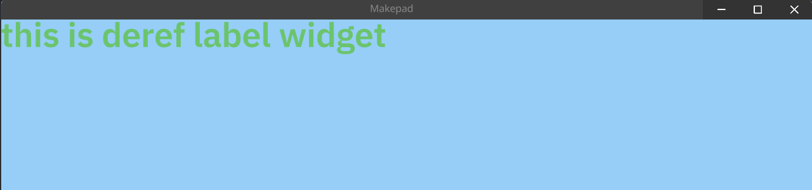

# Extending Widget Functionality with DerefLabel

Following our previous exploration where we introduced the `MyLabel` widget, extending the `Label`, this chapter ventures into more sophisticated use cases. While `Label` provides a robust foundation, there might be instances where its granular control over internal properties isn't necessary for your project's needs.

## Initiating with a New Module

Begin by creating a module specifically for our enhanced widget:

```rust
pub mod deref_label;
```

## Designing a Live Layout

In this step, we define `DerefLabel`, focusing on simplicity and reusability:

```rust
use makepad_widgets::*;

live_design!{
    import makepad_widgets::base::*;
    import makepad_widgets::theme_desktop_dark::*;

    DerefLabel = {{DerefLabel}}{
        instance = <Label>{
            draw_text:{
                text_style: { 
                    font: {
                        path: dep("crate://makepad-widgets/resources/IBMPlexSans-SemiBold.ttf")
                    }, 
                } 
            }
        }
    }
}
```

## Creating a Deref Structure

`DerefLabel` is designed with simplicity and flexibility in mind, allowing for easy customization of text, color, and font size:

```rust
#[derive(Live,Widget,LiveHook)]
pub struct DerefLabel{
    #[live]
    pub text: RcStringMut,
    #[live]
    pub color: Vec4,
    #[live(16.0)]
    pub font_size: f64,
    #[deref]
    view: View
}
```

## Implementing the Widget Trait

With the widget's structure defined, we implement the `Widget` trait to specify how `DerefLabel` behaves and is rendered:

```rust
impl Widget for DerefLabel {
    fn draw_walk(&mut self, cx: &mut Cx2d, scope: &mut Scope, walk: Walk) -> DrawStep {
        
        self.label(id!(instance)).apply_over_and_redraw(cx, live!{
            text: (self.text),
            draw_text:{
                color: (self.color),
                text_style:{
                    font_size: (self.font_size)
                },
            }
        });
        self.view.draw_walk(cx, scope, walk)
    }
    fn set_text(&mut self, v: &str) {
        self.label(id!(instance)).set_text(v);
    }
    fn text(&self) -> String {
       self.text.as_ref().to_string()
    }
}
```

## Use Deref Label

```rust
use makepad_widgets::*;
live_design! {
    import makepad_widgets::base::*;
    import makepad_widgets::theme_desktop_dark::*;
    import makepad_example_simple::deref_label::*;
    App = {{App}}{ 
        ui: <Window>{
            show_bg: true, 
            width: Fill, 
            draw_bg: { color: #96CEF8 }, 
            height: Fill,  
            body = <View>{
                align: {x: 0.5, y: 0.5}, 
                <DerefLabel>{
                    text: "this is deref label widget",
                    color: #6BC46D,
                    font_size: 32.0
                } 
            } 
        } 
    }
}
```

