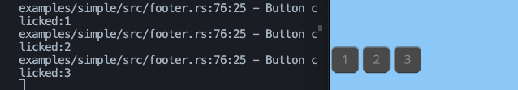

# For Loop Widget

This example demonstrates how to generate components from iterable data in Makepad.

## Write Live Design

Note that we use `btn: <Button>` instead of `btn = <Button>`. This implies that the button is treated as a prop here.

```rust
use makepad_widgets::*;

live_design!{
    // Import the essential base and theme components from makepad_widgets
    import makepad_widgets::base::*;
    import makepad_widgets::theme_desktop_dark::*;
    
    // Define a new component named Footer
    Footer = {{Footer}}{
        // Set the height and width to fill their container
        height: Fill,
        width: Fill,
        // Define a button with a text prop
        btn: <Button>{
            text: "Click me",
        }
    }
}
```

## Define the Widget Struct

Next, we implement a widget that conforms to the Widget trait. Here, we use `Area + LivePtr + ComponentMap`. You can roughly consider these as a standard combination (though that's not entirely accurate).

- `Area`: Provides a renderable area.
- `LivePtr`: A special pointer type used to reference `#[live]` data or resources.
- `ComponentMap`: A container for managing widgets.

```rust
#[derive(Live, LiveHook, Widget)]
pub struct Footer {
    // The area property provides a specific region for rendering
    #[rust]
    #[redraw]
    area: Area,
    // Layout for arranging child widgets or components
    #[layout]
    layout: Layout,
    // Walk specifies how child components are positioned and sized
    #[walk]
    walk: Walk,
    // Optional property to hold a reference to the button's live data
    #[live]
    btn: Option<LivePtr>,
    // Maps button identifiers to their corresponding ButtonRef objects
    #[rust]
    btns: ComponentMap<LiveId, ButtonRef>
}
```

## Draw the Widget

Implement the `draw_walk` method to render the widget.

```rust
impl Widget for Footer {
    fn draw_walk(&mut self, cx: &mut Cx2d, scope: &mut Scope, walk: Walk) -> DrawStep {
        // Start drawing the widget using the specified layout
        cx.begin_turtle(walk, self.layout);
        // Example data to iterate over
        let data = vec!["1","2","3"];
        for (d_id, name) in data.iter().enumerate() {
            let id = LiveId(d_id as u64);
            // Retrieve or insert a new button based on the id
            let c_btn = self.btns.get_or_insert(cx, id, |cx|{
                // Create a new button from the live pointer
                WidgetRef::new_from_ptr(cx, self.btn).as_button()
            });
            // Set the button's text
            c_btn.set_text(name);
            // Draw the button
            c_btn.draw_all(cx, scope);
        }

        // End the drawing process for the current widget
        cx.end_turtle();
        // Retain only the buttons that are visible
        self.btns.retain_visible();
        // Indicate that the drawing step is complete
        DrawStep::done()
    }
}
```
---

## Impl handle_event

In order for all buttons to receive events, we need to implement the `handle_event` function

```rust
impl Widget for Footer{

    // ... draw_walk() fn

    fn handle_event(&mut self, cx: &mut Cx, event: &Event, scope: &mut Scope) {
        // Handle events for the current widget
        for btn in self.btns.values_mut(){
            // btn.handle_event(cx, event, scope);
            for action in cx.capture_actions(|cx| btn.handle_event(cx, event, scope)){
                match action.as_widget_action().cast() {
                    // Handle button actions
                    ButtonAction::Clicked => {
                        log!("Button clicked:{}", btn.text());
                    }
                    _ => {}
                }
            }
        }
    }
}
```



## Pass Event

Now we need to implement event passing for the Footer widget, so that when any sub button is clicked, the Footer widget will trigger a Focus event

### Define Footer Action

Define a Focus event which get LiveId(Button's LiveId)

```rust
#[derive(Clone, Debug, DefaultNone)]
pub enum FooterAction{
    None,
    // LiveId can specialize the clicked button
    Focus(LiveId),
}
```

### Change handle_event

```rust
impl Widget for Footer{

    // ... draw_walk() fn

    fn handle_event(&mut self, cx: &mut Cx, event: &Event, scope: &mut Scope) {
        let uid = self.widget_uid();
        // Handle events for the current widget
        for (btn_id, btn) in self.btns.iter_mut(){
            // btn.handle_event(cx, event, scope);
            for action in cx.capture_actions(|cx| btn.handle_event(cx, event, scope)){
                match action.as_widget_action().cast() {
                    // Handle button actions
                    ButtonAction::Clicked => {
                        log!("Button clicked:{}", btn.text());
                        // pass event
                        cx.widget_action(uid, &scope.path, FooterAction::Focus(*btn_id))
                    }
                    _ => {}
                }
            }
        }
    }
}
```

### Impl MatchEvent for Parent Widget

impl `handle_actions` function, match the action we need to do and then handle.

```rust
impl MatchEvent for App{
    fn handle_actions(&mut self, cx: &mut Cx, actions: &Actions) {
        for action in actions{
            match action.as_widget_action().cast(){
                FooterAction::Focus(btn_id) => {
                    log!("Button focused:{}", btn_id);
                }
                _ => {
                    log!("other");
                }
            };
        }
    }
}
```