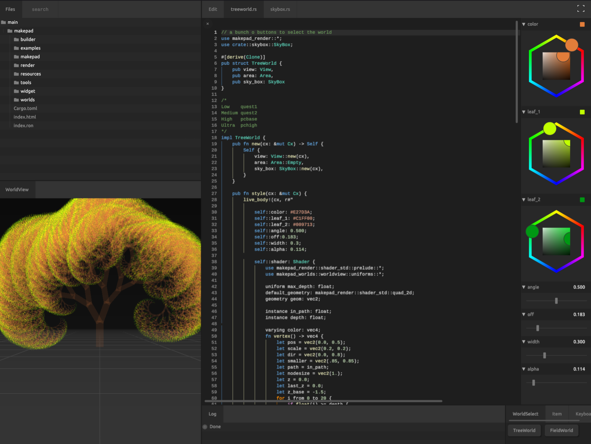

# Introduction

- <svg aria-hidden="true" class="astro-wy4te6ga astro-c6vsoqas" width="14" height="14" viewBox="0 0 24 24" fill="currentColor" style="--sl-icon-size: 1em;"><path d="M12 .3a12 12 0 0 0-3.8 23.38c.6.12.83-.26.83-.57L9 21.07c-3.34.72-4.04-1.61-4.04-1.61-.55-1.39-1.34-1.76-1.34-1.76-1.08-.74.09-.73.09-.73 1.2.09 1.83 1.24 1.83 1.24 1.08 1.83 2.81 1.3 3.5 1 .1-.78.42-1.31.76-1.61-2.67-.3-5.47-1.33-5.47-5.93 0-1.31.47-2.38 1.24-3.22-.14-.3-.54-1.52.1-3.18 0 0 1-.32 3.3 1.23a11.5 11.5 0 0 1 6 0c2.28-1.55 3.29-1.23 3.29-1.23.64 1.66.24 2.88.12 3.18a4.65 4.65 0 0 1 1.23 3.22c0 4.61-2.8 5.63-5.48 5.92.42.36.81 1.1.81 2.22l-.01 3.29c0 .31.2.69.82.57A12 12 0 0 0 12 .3Z"></path></svg>[Makepad](https://github.com/makepad/makepad)
- [Dev Web](https://makepad.dev/)
- <svg aria-hidden="true" class="astro-wy4te6ga astro-c6vsoqas" width="14" height="14" viewBox="0 0 24 24" fill="currentColor" style="--sl-icon-size: 1em;"><path d="M12 .3a12 12 0 0 0-3.8 23.38c.6.12.83-.26.83-.57L9 21.07c-3.34.72-4.04-1.61-4.04-1.61-.55-1.39-1.34-1.76-1.34-1.76-1.08-.74.09-.73.09-.73 1.2.09 1.83 1.24 1.83 1.24 1.08 1.83 2.81 1.3 3.5 1 .1-.78.42-1.31.76-1.61-2.67-.3-5.47-1.33-5.47-5.93 0-1.31.47-2.38 1.24-3.22-.14-.3-.54-1.52.1-3.18 0 0 1-.32 3.3 1.23a11.5 11.5 0 0 1 6 0c2.28-1.55 3.29-1.23 3.29-1.23.64 1.66.24 2.88.12 3.18a4.65 4.65 0 0 1 1.23 3.22c0 4.61-2.8 5.63-5.48 5.92.42.36.81 1.1.81 2.22l-.01 3.29c0 .31.2.69.82.57A12 12 0 0 0 12 .3Z"></path></svg>[Makepad Book](https://github.com/palpus-rs/Gen-UI.github.io)
- <svg aria-hidden="true" class="astro-wy4te6ga astro-c6vsoqas" width="14" height="14" viewBox="0 0 24 24" fill="currentColor" style="--sl-icon-size: 1em;"><path d="M20.32 4.37a19.8 19.8 0 0 0-4.93-1.51 13.78 13.78 0 0 0-.64 1.28 18.27 18.27 0 0 0-5.5 0 12.64 12.64 0 0 0-.64-1.28h-.05A19.74 19.74 0 0 0 3.64 4.4 20.26 20.26 0 0 0 .11 18.09l.02.02a19.9 19.9 0 0 0 6.04 3.03l.04-.02a14.24 14.24 0 0 0 1.23-2.03.08.08 0 0 0-.05-.07 13.1 13.1 0 0 1-1.9-.92.08.08 0 0 1 .02-.1 10.2 10.2 0 0 0 .41-.31h.04a14.2 14.2 0 0 0 12.1 0l.04.01a9.63 9.63 0 0 0 .4.32.08.08 0 0 1-.03.1 12.29 12.29 0 0 1-1.9.91.08.08 0 0 0-.02.1 15.97 15.97 0 0 0 1.27 2.01h.04a19.84 19.84 0 0 0 6.03-3.05v-.03a20.12 20.12 0 0 0-3.57-13.69ZM8.02 15.33c-1.18 0-2.16-1.08-2.16-2.42 0-1.33.96-2.42 2.16-2.42 1.21 0 2.18 1.1 2.16 2.42 0 1.34-.96 2.42-2.16 2.42Zm7.97 0c-1.18 0-2.15-1.08-2.15-2.42 0-1.33.95-2.42 2.15-2.42 1.22 0 2.18 1.1 2.16 2.42 0 1.34-.94 2.42-2.16 2.42Z"></path></svg>[Discord](https://discord.gg/adqBRq7Ece)
- <svg aria-hidden="true" class="astro-wy4te6ga astro-c6vsoqas" width="14" height="14" viewBox="0 0 24 24" fill="currentColor" style="--sl-icon-size: 1em;"><path d="M 18.242188 2.25 L 21.554688 2.25 L 14.324219 10.507812 L 22.828125 21.75 L 16.171875 21.75 L 10.953125 14.933594 L 4.992188 21.75 L 1.679688 21.75 L 9.40625 12.914062 L 1.257812 2.25 L 8.082031 2.25 L 12.792969 8.480469 Z M 17.082031 19.773438 L 18.914062 19.773438 L 7.082031 4.125 L 5.113281 4.125 Z M 17.082031 19.773438 "></path></svg>[Rik Arends Twitter](https://fosstodon.org/@rikarends#)
- 📕Book Author Email: [syf20020816@outlook.com]()

[Makepad](https://github.com/makepad/makepad) is a cross platform text editor and development environment developed using the Rust programming language. It emphasizes the advantages in performance and scalability, aiming to provide developers with an efficient and responsive coding experience. Makepad uses its own rendering engine, also written in Rust, which allows it to maintain smooth performance when rendering large projects.

Some features of Makepad include:

1. **Cross platform support**: Makepad can run on multiple operating systems, including Windows, macOS, and Linux, thanks to Rust and its cross platform compatibility.

2. **Custom rendering engine**: Makepad uses its own developed rendering engine, which means it can optimize rendering performance while also supporting complex visual effects and animations.

3. **Develop using the Rust language**: The security and performance of Rust enable Makepad to efficiently handle large files and complex projects while maintaining low memory usage and fast response.

4. **Code Editing and Project Management**: Makepad is not only a text editor, but also provides project management tools to help developers organize and manage their code repository.

5. **Scalability**: Makepad is designed to support plugins and extensions, allowing developers to customize editor functionality according to their own needs.

6. **Future oriented design**: The development team of Makepad is committed to exploring new programming paradigms and tools, such as using modern technologies such as WebGPU to push the boundaries between front-end and graphical programming.

Makepad is a relatively new project that is still actively being developed, which means it will continuously introduce new features and improve existing ones. For Rust developers and other programmers seeking modern, high-performance, and customizable development tools, Makepad may be an interesting choice.

## Who is this book for?

- Rust GUI Developers
- Rust WebAssembly Developers
- Rust GUI Third Part Component Lib Developers

In this book, you can learn:

1. How To Begin Makepad
2. Makepad BuiltIn Basic Widgets
3. Makepad BuiltIn Component (`theme_desktop_dark`)
4. Makepad BuiltIn Types
5. Makepad Example Analysis
6. Makepad Defination Component Lib

> ‼️ Note
> 
> Help us improve!
>
> If you find any mistakes or something that could be better wirtten, you can do these following:
>
> 1. Create an issue or Discussion in Book Github Repository or make a discussion in Discord
> 2. Share with Others then get some suggestions 
> 3. Fork and Update **Lastest** 
> 4. Optimize Book and Push

<a href="./installation.md" style="cursor: pointer;background-color: #161923; border: none; box-shadow: 2px 2px 12px 2px #282D3F;width: 100%;padding: 16px;box-sizing: border-box;border-radius: 8px;display: inline-block;color:#EF5350;">

<!-- 

 -->

Next Page Installation🔽

</a>