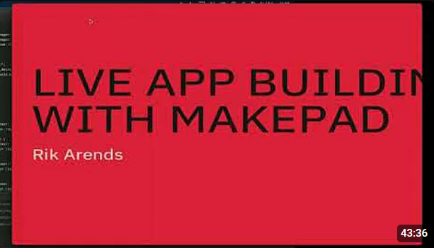
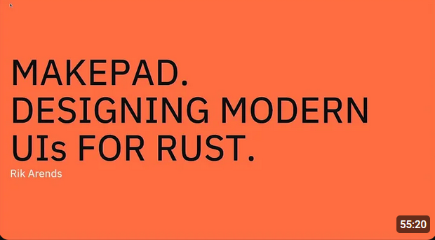
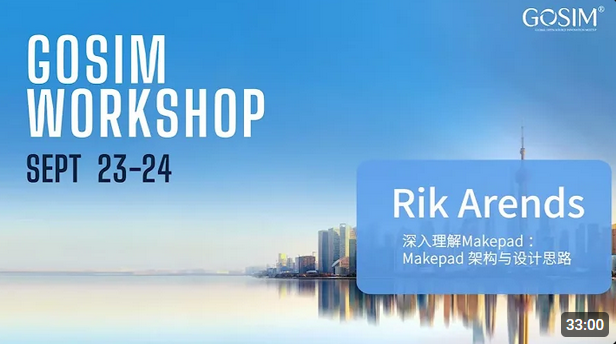

# Videos

##  YouTube

### Makepad: How to use Rust for fast UI – Rik Arends
<div>
<div style="display: flex; justify-content: center;">

</div>
<div style="display: flex; justify-content: center;">
<a style="margin:16px 0; font-size: 18px;font-weight:700;" href="https://www.youtube.com/watch?v=IU33AWKywpA">Makepad: How to use Rust for fast UI – Rik Arends</a>
</div>
</div>

### Makepad: Designing modern UIs with Rust - Rik Arends - RustNL 2023 
<div>
<div style="display: flex; justify-content: center;">

</div>
<div style="display: flex; justify-content: center;">
<a style="margin:16px 0; font-size: 18px;font-weight:700;" href="https://www.youtube.com/watch?v=rC4FCS-oMpg">Makepad: Designing modern UIs with Rust - Rik Arends - RustNL 2023 </a>
</div>
</div>

### Makepad: How to use Rust for fast UI – Rik Arends
<div>
<div style="display: flex; justify-content: center;">

</div>
<div style="display: flex; justify-content: center;">
<a style="margin:16px 0; font-size: 18px;font-weight:700;" href="https://www.youtube.com/watch?v=afJJW2LuVWg">Makepad In-depth Architecture and Design Internals — Rik Arends | GOSIM Workshop 2023</a>
</div>
</div>

##  Bilibili


> ### ‼️ Note
>
> Contribute Video
>
> We will update **Videos Collection** per 2 Week in YouTube and Bilibili 
> 
> Or you can send email to remind us (**syf20020816@outlook.com**)
> 
> ### Email Format:
> ```
> ${{video_name}}
> ${{author}}
> ${{video_url}}
> ${{email}}
> ${{description}}
> ```